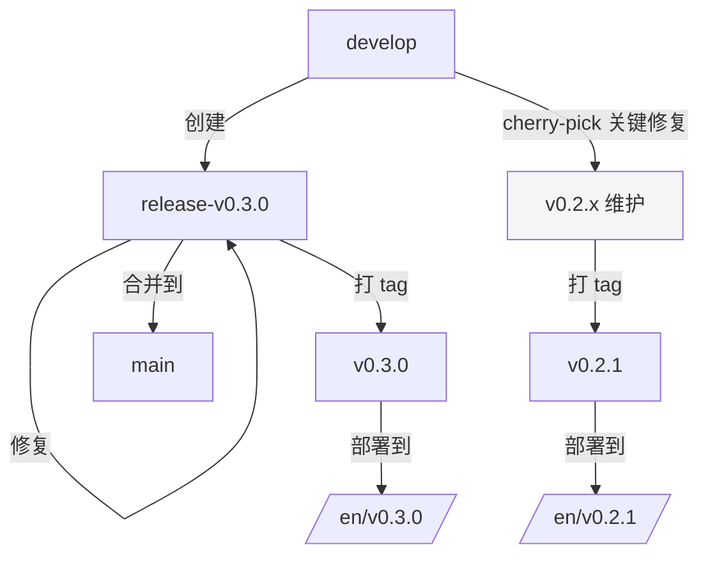
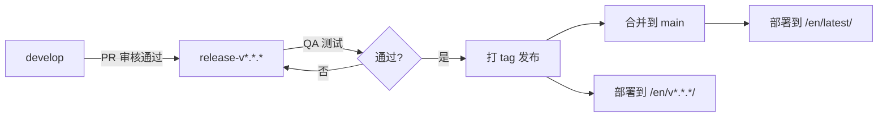

# unisdk-doc 文档架构与规范重组计划

## 概述

对 `unisdk-doc` 文档仓库进行三大维度的架构重组与规范化：**中英文架构**、**版本架构**、**文档结构规范**，以提高可维护性和规范化程度。

---

## 关键关系：文档版本 vs SDK 版本

文档版本与 SDK (unisdk) 版本采用 **版本对齐，不额外 tag** 模式：

```
SDK v0.2.0 发布 ──→ 文档打 v0.2.0 tag（配套文档）
                        │
                  文档发现错误 ──→ 直接合并到 main，不额外 tag
                        │          latest 自动更新，不产生新版本号
SDK v0.3.0 发布 ──→ 文档打 v0.3.0 tag（新一轮对齐）
```

| 场景 | 文档 tag | 说明 |
|---|---|---|
| SDK 同步发布 | `v<SDK版本>`（如 `v0.2.0`） | SDK 和文档同时发布，一一对应 |
| 文档独立修补 | **不打 tag** | 直接合并到 main，latest 自动更新 |
| 开发中预览 | 无 tag（develop 分支 → `dev`） | CI 自动部署到 `/en/dev/` |
| 稳定版占位 | 无 tag（main 分支 → `latest`） | CI 自动部署到 `/en/latest/` |

**核心原则**:
1. 文档 tag 与 SDK tag **严格一一对应**：每个 SDK release 最多一个文档 tag
2. 文档独立修补不需要新 tag，直接合并到 `main` 更新 `latest`
3. 已发布的历史版本（如 `v0.2.0` 的文档）不再更新修补

## 决策记录

| 决策项 | 选定方案 | 理由 |
|---|---|---|
| 文档版本与 SDK 版本关系 | 版本对齐，不额外 tag | 文档修补直接合并到 main 更新 latest，减少 tag 管理成本 |
| 中英文路线 | sphinx-intl 翻译 | 维护成本低，内容对齐度高 |
| 目录布局 | 源文件移出 `en/` 到根目录 | sphinx-intl 标准用法，构建时按语言输出 |
| 目录命名组织 | 需要标准化 | 涵盖：命名规则、分类标准 |
| Frontmatter 元数据 | 需要标准化 | 统一 title/status/tags 等 |
| 文件格式规范 | 需要标准化 | 明确 Markdown/RST 使用场景 |
| 交叉引用规范 | 需要标准化 | 统一内部链接和术语引用 |
| 版本号规范 | 需要建立 | 语义化版本 + changelog |
| 多版本维护 | 需要建立 | backport 流程和策略 |
| 版本差异标记 | 需要建立 | 在文档中标注版本变更 |
| 发布审批流程 | 需要建立 | dev → release → main 的 QA 流程 |

---

## 具体变更

### 变更 1: 中英文架构 — sphinx-intl 集成

#### 1.1 目录结构调整

将文档源文件从 `en/` 移出到根级语言无关目录，重构后目录结构：

```
unisdk-doc/
├── source/                        # ← 语言无关的文档源文件（新建）
│   ├── index.rst                  # ← 原 en/index.rst（master toctree）
│   ├── terminology.md
│   ├── about/
│   ├── api_reference/
│   ├── build_config/
│   ├── chips_boards/
│   ├── connectivity/
│   ├── contribute/
│   ├── developing/
│   ├── getting_started/
│   ├── introduction/
│   ├── kconfig_reference/
│   ├── peripherals/
│   ├── productization/
│   ├── releases/
│   ├── samples/
│   ├── security/
│   ├── support/
│   ├── system_services/
│   ├── tools/
│   └── yaml_reference/
├── locale/                        # ← 国际化翻译文件
│   ├── en/LC_MESSAGES/            #   英文原文（可选，或直接从 source 获取）
│   └── zh/LC_MESSAGES/            #   中文翻译 .po 文件
├── en/                            # ← 构建产物（.gitignore 中排除）
├── zh/                            # ← 构建产物（.gitignore 中排除）
├── _build/                        # ← 构建中间产物
├── conf.py                        # ← 更新配置
├── ...
```

**操作步骤**:
1. 创建 `source/` 目录
2. 将 `en/` 下所有内容（除 `index.rst` 中的语言特定引用外）移动到 `source/`
3. 更新 `conf.py` 中的 `master_doc`、`source_suffix`、`exclude_patterns`
4. 更新 `source/index.rst` 中的路径引用
5. 将 `source/` 中的 `index.rst` 设为默认 master doc
6. 更新 CI/CD 工作流中的构建命令

#### 1.2 conf.py 配置更新

```python
# 启用 sphinx-intl
extensions = [
    ...
    'sphinx_intl',  # 取消注释
    ...
]

# 语言配置
language = os.environ.get('UNISDK_DOC_LANG', 'en')  # 默认英文
locale_dirs = ['locale/']
gettext_compact = False  # 保持目录结构，不合并

# master_doc 改为语言无关的 source/index
master_doc = 'source/index'

# 源文件路径
source_suffix = {
    '.rst': 'restructuredtext',
    '.md': 'markdown',
}
```

#### 1.3 翻译工作流

```bash
# 1. 提取可翻译字符串（生成 .pot 文件）
sphinx-build -b gettext source/ _build/gettext

# 2. 更新 .po 文件
sphinx-intl update -p _build/gettext -l zh

# 3. 翻译 locale/zh/LC_MESSAGES/ 下的 .po 文件

# 4. 构建中文版本
UNISDK_DOC_LANG=zh sphinx-build -b html -D language=zh source/ _build/html/zh

# 5. 构建英文版本
UNISDK_DOC_LANG=en sphinx-build -b html -D language=en source/ _build/html/en
```

#### 1.4 CI/CD 更新

`.github/workflows/docs-deploy.yml` 中的变更:
- `LANGUAGES: "en"` → `LANGUAGES: "en zh"`（当中文内容就绪后）
- sphinx-build 命令更新源路径：从 `en/` → `source/`
- Master doc 参数调整

#### 1.5 模板更新

- `_templates/language_switcher.html`：添加中文选项
- `_templates/layout.html`：确保语言选择器正确显示
- `scripts/generate_landing.py`：更新语言遍历列表

---

### 变更 2: 版本架构规范化

#### 2.1 版本号规范

采用 **语义化版本**（Semantic Versioning）：`MAJOR.MINOR.PATCH`

| 版本位 | 含义 | 示例 |
|---|---|---|
| MAJOR | 不兼容的 API 变更 | `v1.0.0` → `v2.0.0` |
| MINOR | 向下兼容的功能新增 | `v1.0.0` → `v1.1.0` |
| PATCH | 向下兼容的缺陷修复 | `v1.0.0` → `v1.0.1` |

文档版本与 SDK 版本对齐，使用 `v*.*.*` 格式（如 `v0.2.0`）。

- **文件**: `en/contribute/index.md`
- **操作**: 在贡献指南中添加版本号规范说明

#### 2.2 Changelog 规范

建立标准的 CHANGELOG 格式（基于 Keep a Changelog）：

```markdown
# Changelog

## v0.2.0 - 2025-01-15

### Added
- 新特性说明

### Changed
- 变更说明

### Deprecated
- 即将废弃的功能

### Removed
- 已移除的功能

### Fixed
- 修复说明

### Security
- 安全修复
```

- **文件**: `en/releases/index.md`（或新建 `CHANGELOG.md`）
- **操作**: 按上述格式重写发布说明

#### 2.3 多版本并行维护策略



**策略**:
- 仅最新 minor 版本进行常规维护
- 前一个 minor 版本仅接受安全修复和关键 bug fix（通过 cherry-pick）
- 更早的版本不再维护，文档中标记为 `DEPRECATED`
- 每个 minor 版本建立 `release-v*.*.x` 维护分支

- **文件**: `en/contribute/index.md`
- **操作**: 添加多版本维护策略说明

#### 2.4 版本差异标记

在文档 frontmatter 中增加版本相关字段：

```yaml
---
title: GPIO Driver Guide
status: STABLE
since: v0.1.0          # 首次引入的版本
updated: v0.2.0        # 最后更新的版本
deprecated: null       # 废弃版本（如有）
---
```

文档正文中使用 Sphinx 的 `versionadded`、`versionchanged`、`deprecated` 指令：

```rst
.. versionadded:: v0.2.0
   新增 DMA 传输模式支持

.. deprecated:: v0.1.0
   `legacy_api()` 已废弃，请使用 `new_api()` 替代
```

- **文件**: `conf.py`、文档模板、示例文档
- **操作**: 启用 `sphinx.ext.extlinks` 中的版本相关扩展，培训作者使用版本标记

#### 2.5 发布审批流程



**流程文档**:
- **文件**: `en/contribute/index.md`
- **操作**: 添加发布流程说明，含：
  1. 从 `develop` 创建 `release-v*.*.*` 分支
  2. 在 release 分支上进行最终审核和修复
  3. 打 tag（`v*.*.*`）触发 CI 构建
  4. 合并 release 分支到 `main`
  5. 通知团队发布完成

---

### 变更 3: 文档结构规范化

#### 3.1 目录命名规则

| 规则 | 说明 | 示例 |
|---|---|---|
| 蛇形命名 | 目录名使用小写字母 + 下划线 | `getting_started/`, `chips_boards/` |
| 单数形式 | 目录名使用单数 | `peripheral/` 而非 `peripherals/`（当前为复数，需迁移） |
| index 入口 | 每个目录必须有 `index.md` 或 `index.rst` | — |
| 图片目录 | 图片统一放在 `_images/` 目录下 | `peripherals/_images/gpio_1.png` |

**当前需要调整的目录**:
- `peripherals/` → 保持（已是单数）
- `samples/` → 保持
- `tools/` → 保持
- 图片从 `pics/` 迁移到 `_images/`

- **文件**: 涉及目录结构的多个文件
- **操作**: 逐步迁移目录和更新引用

#### 3.2 Frontmatter 元数据规范

所有文档文件必须包含以下 frontmatter：

```yaml
---
title: 文档标题          # 必需，文档的显示标题
status: DRAFT            # 必需，STABLE/DRAFT/DEPRECATED/PLANNED
since: v0.1.0            # 可选，首次引入版本
updated: v0.2.0          # 可选，最后更新版本
description: 简短描述    # 可选，用于搜索和索引
tags: [gpio, peripheral] # 可选，标签用于分类和搜索
---
```

**新增元数据字段**:
- `description` — 文档摘要描述
- `tags` — 标签列表
- `since` — 引入版本
- `updated` — 最后更新版本

- **文件**: `en/contribute/index.md`（更新规范说明）  
- **操作**: 更新贡献指南，添加 frontmatter 规范

#### 3.3 文件格式规范

| 场景 | 推荐格式 | 原因 |
|---|---|---|
| 主目录文件 | `.rst` | 需要 toctree 指令 |
| 内容页面 | `.md` (MyST) | 更易读写，生态广泛 |
| API 参考 | `.rst` (自动生成) | `gen_api_rst.py` 产出 |
| 表格密集型页面 | `.rst` | RST 表格语法更强大 |

**Markdown 规范**:
- 标题层级：`#` → `##` → `###` → `####`（最多 4 级）
- 代码块：标注语言（`` ```c ``、`` ```bash ``）
- 图片：使用 `` 并添加 `:width:` 指令
- 链接：使用 MyST 风格的 `{ref}` 和 `{doc}` 引用
- 告警：使用 MyST 的 ````{note}`, ````{warning}`, ````{tip}` 指令

**RST 规范**:
- 使用 `.. code-block:: c` 代替 `::` 后接缩进
- 使用 `:ref:` 和 `:doc:` 进行交叉引用
- 使用 `.. versionadded::` / `.. deprecated::` 标记版本变更

- **文件**: `en/contribute/index.md`（更新规范说明）
- **操作**: 添加文件格式规范章节

#### 3.4 交叉引用规范

| 引用类型 | 语法 | 示例 |
|---|---|---|
| 文档引用 | `{doc}` / `:doc:` | `{doc}getting_started/index` |
| 章节引用 | `{ref}` / `:ref:` | `{ref}my-section-label` |
| 外部链接 | Markdown 链接 | `[text](url)` |
| API 引用 | `{c:func}` / `{c:type}` | `{c:func}tlk_gpio_init` |
| 术语引用 | `{term}` / `:term:` | `{term}GPIO` |

**标签命名规范**:
```
<module>-<section>  示例: gpio-introduction, uart-dma-mode
```

- **文件**: `en/contribute/index.md`（更新规范说明）
- **操作**: 添加交叉引用规范章节

---

## 实施优先级

| 优先级 | 变更 | 依赖 | 预估工作量 |
|---|---|---|---|
| P0 | 文档结构规范（规则定义 + 贡献指南更新） | 无 | 小 |
| P0 | 版本架构规范（版本号、changelog、发布流程） | 无 | 小 |
| P1 | sphinx-intl 目录结构调整（source/ 迁移） | 文档结构规范 | 中 |
| P1 | conf.py sphinx-intl 配置 | 目录结构调整 | 小 |
| P2 | 翻译工作流搭建 | sphinx-intl 配置 | 中 |
| P2 | CI/CD 多语言构建更新 | sphinx-intl 配置 | 小 |
| P3 | 版本差异标记（versionadded 等） | 版本架构规范 | 小 |
| P3 | 多版本并行维护策略实施 | 版本架构规范 | 小 |
| P3 | 实际翻译工作开展 | 翻译工作流 | 大 |

---

## 验证步骤

1. `sphinx-build -b gettext source/ _build/gettext` 成功提取 .pot 文件
2. `sphinx-intl update -p _build/gettext -l zh` 成功生成 .po 文件
3. `UNISDK_DOC_LANG=en sphinx-build -b html source/ _build/html/en` 构建英文成功
4. `UNISDK_DOC_LANG=zh sphinx-build -b html source/ _build/html/zh` 构建中文成功
5. 着陆页正确展示中英文版本入口
6. 版本切换器和语言切换器功能正常
7. CI/CD 能同时构建 en 和 zh 并部署到正确路径
8. 所有文档页面包含规范的 frontmatter 元数据
9. 交叉引用在构建过程中不产生警告

---

## 后续工作

1. 文档结构规范定稿后，对现有文档进行批量 frontmatter 补充
2. sphinx-intl 就绪后，建立翻译团队和审校流程
3. 首个中文版本发布后，同步更新 landing page 和版本切换器语言选项
4. 定期审查版本维护策略，确保与 SDK 发布节奏对齐
