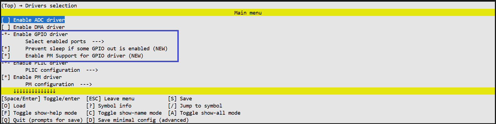
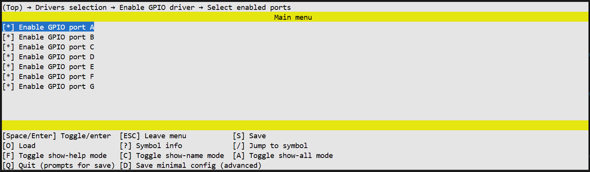

# GPIO Driver Documentation

## Overview
The GPIO (General Purpose Input/Output) driver provides an interface for configuring and utilizing the microcontroller's general-purpose pins. The driver supports pin mode configuration (input, output, pull-up, pull-down), pin multiplexing (Pinmux), and direct pin state manipulation (write, read, toggle). It also supports interrupt handling with configurable triggers and callback registration.

**Key Features:**
- Configuration of GPIO modes (Input, Output, Pull-up, Pull-down).
- Pin multiplexing for alternate functions.
- Direct pin control (Write, Read, Toggle).
- Interrupt handling with configurable triggers (Edge/Level) and callbacks.
- Ability to disable pin functionality.


## Data Types and Enumerations
The following section describes the enumerations and data types used to configure and work with the GPIO driver.

### 1. Port Identification
**Enum:** `tlk_gpio_port`

GPIO port identifiers are generated at build time according to UNISDK_GPIO_PORT_COUNT and including only those ports for which `CONFIG_TLK_GPIO_PORT_##num##_ENABLED` is set.

| Items | Description |
| :--- | :--- |
| `GPIO_PORT_x` | GPIO port identifier generated for each enabled port `CONFIG_TLK_GPIO_PORT_x_ENABLED`. |


### 2. Pin Definitions
**Enum:** `tlk_gpio_pin`

Defines the bitmask for specific pins within a port.

| Items | Description |
| :--- | :--- |
| `TLK_GPIO_PIN_NONE` | No pin selected (Value 0). |
| `GPIO_PIN_x` | Pin index bitmask (where x is 0-7), defined as `TLK_BIT(x)`. |


### 3. Pin Mode Configuration
**Enum:** `tlk_gpio_mode`

Defines the operating mode for a GPIO pin, including input/output direction and pull-up/pull-down resistor configuration.

| Items | Description |
| :--- | :--- |
| `TLK_GPIO_OUTPUT` | Configures the pin as a digital output (Value -1). |
| `TLK_GPIO_INPUT_NO_PULL` | Configures the pin as a floating digital input (Value 0). |
| `TLK_GPIO_INPUT_PULL_UP` | Configures the pin as an input with the default internal pull-up resistor enabled. |
| `TLK_GPIO_INPUT_PULL_DOWN` | Configures the pin as an input with the default internal pull-down resistor enabled. |
| `TLK_GPIO_INPUT_PULL_UP_{name}`| *Generated based on config: `UNISDK_GPIO_PULL_DOWN_OPTIONS_COUNT`* Input with a specific pull-up value. |
| `TLK_GPIO_INPUT_PULL_DOWN_{name}`| *Generated based on config: `UNISDK_GPIO_PULL_DOWN_OPTIONS_COUNT`* Input with a specific pull-down value. |


### 4. Interrupt Trigger Configuration
**Enum:** `tlk_gpio_intr_trigger`

Defines the condition that triggers a GPIO interrupt.

| Items | Description |
| :--- | :--- |
| `TLK_GPIO_INTR_RISING_EDGE` | Interrupt triggers on the rising edge (low to high transition). |
| `TLK_GPIO_INTR_FALLING_EDGE` | Interrupt triggers on the falling edge (high to low transition). |
| `TLK_GPIO_INTR_HIGH_LEVEL` | Interrupt triggers while the signal is at a logical high level. |
| `TLK_GPIO_INTR_LOW_LEVEL` | Interrupt triggers while the signal is at a logical low level. |
| `TLK_GPIO_INTR_BOTH_EDGE` | Interrupt triggers on both rising and falling edges. |


### 5. Port and Pin Structure
**Struct:** `tlk_gpio_port_pin`

Structure used to group a port and pin identifier together for API calls.

```c
struct tlk_gpio_port_pin {
    enum tlk_gpio_port port;
    enum tlk_gpio_pin pin;
};
```


### 6. Interrupt Callback Types

**Type:** `tlk_gpio_irq_callback_handler`  
**Struct:** `tlk_gpio_irq_callback`

Defines types used for handling GPIO interrupts via user-registered callbacks.

#### Callback Handler Type

Function pointer type for a GPIO interrupt callback.

```c
typedef void (*tlk_gpio_irq_callback_handler)(enum tlk_gpio_port port,
                                          enum tlk_gpio_pin pin);
```

| Parameters | Description |
| :--- | :--- |
| `port` | GPIO port on which the interrupt occurred. |
| `pin` | GPIO pin that triggered the interrupt. |

#### Callback Registration Structure

Structure used to register a GPIO interrupt callback in the internal callback list.

```c
struct tlk_gpio_irq_callback {
    struct tlk_list_node node;
    tlk_gpio_irq_callback_handler handler;
    enum tlk_gpio_pin pin;
};
```

| Field | Description |
| :--- | :--- |
| `node` | Internal list node used to link callbacks. |
| `handler` | User-defined interrupt callback function. |
| `pin` | GPIO pin associated with this callback. |


## Driver APIs

### 1. `tlk_gpio_disable`
Turns off the pin's functionality and resets its configuration.

**Prototype:**
```c
void tlk_gpio_disable(enum tlk_gpio_port port, enum tlk_gpio_pin pin);
```

**Parameters:**

| Parameter | Type | Description |
| --- | --- | --- |
| `port` | `enum tlk_gpio_port` | GPIO port. |
| `pin` | `enum tlk_gpio_pin` | GPIO pin. |

**Return Value:**
None


### 2. `tlk_gpio_configure`
Sets the GPIO mode for the specified port and pin.
The pin can be configured for Input (with optional pull-up or pull-down) or Output.

**Prototype:**
```c
void tlk_gpio_configure(enum tlk_gpio_port port,
                    enum tlk_gpio_pin pin,
                    enum tlk_gpio_mode mode);
```

**Parameters:**

| Parameter | Type | Description |
| --- | --- | --- |
| `port` | `enum tlk_gpio_port` | GPIO port. |
| `pin` | `enum tlk_gpio_pin` | GPIO pin. |
| `mode` | `enum tlk_gpio_mode` | GPIO mode (output / input pull-up / pull-down). |

**Return Value:**
None


### 3. `tlk_gpio_pin_write`
Sets the pin output to high (`true`) or low (`false`).

**Prototype:**
```c
void tlk_gpio_pin_write(enum tlk_gpio_port port,
                    enum tlk_gpio_pin pin,
                    bool value);
```

**Parameters:**

| Parameter | Type | Description |
| --- | --- | --- |
| `port` | `enum tlk_gpio_port` | GPIO port. |
| `pin` | `enum tlk_gpio_pin` | GPIO pin. |
| `value` | `bool` | Logic level (`true` = high, `false` = low). |

**Return Value:**
None


### 4. `tlk_gpio_pin_toggle`
Inverts the current output value of a GPIO pin.

**Prototype:**
```c
void tlk_gpio_pin_toggle(enum tlk_gpio_port port, enum tlk_gpio_pin pin);
```

**Parameters:**

| Parameter | Type | Description |
| --- | --- | --- |
| `port` | `enum tlk_gpio_port` | GPIO port. |
| `pin` | `enum tlk_gpio_pin` | GPIO pin. |

**Return Value:**
None


### 5. `tlk_gpio_pin_read`
Reads the current logical level of a GPIO pin regardless of its mode.

**Prototype:**
```c
bool tlk_gpio_pin_read(enum tlk_gpio_port port, enum tlk_gpio_pin pin);
```

**Parameters:**

| Parameter | Type | Description |
| --- | --- | --- |
| `port` | `enum tlk_gpio_port` | GPIO port. |
| `pin` | `enum tlk_gpio_pin` | GPIO pin. |

**Return Value:**
Returns `true` if the pin level is high, and `false` if low.


### 6. `tlk_gpio_set_mux`
Configures the pin's alternate function (MUX).

**Prototype:**
```c
void tlk_gpio_set_mux(enum tlk_gpio_port port,
                  enum tlk_gpio_pin pin,
                  uint8_t mux);
```

**Parameters:**

| Parameter | Type | Description |
| --- | --- | --- |
| `port` | `enum tlk_gpio_port` | GPIO port. |
| `pin` | `enum tlk_gpio_pin` | GPIO pin. |
| `mux` | `uint8_t` | Multiplexer index for the selected function. |

**Return Value:**
None

### 7. `tlk_gpio_irq_configure`
*This API is available only if `CONFIG_TLK_PLIC` is enabled.*

Sets the interrupt trigger type for the given pin.

**Prototype:**
```c
void tlk_gpio_irq_configure(enum tlk_gpio_port port,
                        enum tlk_gpio_pin pin,
                        enum tlk_gpio_intr_trigger trigger);
```

**Parameters:**

| Parameter | Type | Description |
| --- | --- | --- |
| `port` | `enum tlk_gpio_port` | GPIO port. |
| `pin` | `enum tlk_gpio_pin` | GPIO pin. |
| `trigger` | `enum tlk_gpio_intr_trigger` | Interrupt trigger mode (edge or level). |

**Return Value:**
None


### 8. `tlk_gpio_irq_add_callback`
*This API is available only if `CONFIG_TLK_PLIC` is enabled.*

Adds a callback to the internal interrupt callback list for the specified port.

**Prototype:**
```c
void tlk_gpio_irq_add_callback(enum tlk_gpio_port port,
                           struct tlk_gpio_irq_callback *callback);
```

**Parameters:**

| Parameter | Type | Description |
| --- | --- | --- |
| `port` | `enum tlk_gpio_port` | GPIO port. |
| `callback` | `struct tlk_gpio_irq_callback *` | Pointer to GPIO interrupt callback structure. |

**Return Value:**
None


## GPIO Configuration
This section describes GPIO configuration options.

### Configurations

```text
GPIO_PORT_{name}_ENABLED
│   Enables the specific GPIO port instance (where {name} is the port name, e.g., A, B, etc.).
│   Automatically selects the corresponding internal port index.
│   Default: `y`

TLK_GPIO_PREVENT_SLEEP
│   Indicates that the system should not enter sleep mode if any GPIO configured as an output is enabled.
│   Default: `y` if `PM` is enabled, otherwise `n`.

TLK_GPIO_PM_DEVICE
│   Indicates that Power Management support is enabled for the GPIO driver.
│   Default: `y` if `PM` is enabled, otherwise `n`.
```


### View in the menuconfig


*Figure 1. GPIO driver configurations*


*Figure 2. GPIO driver ports configurations*
