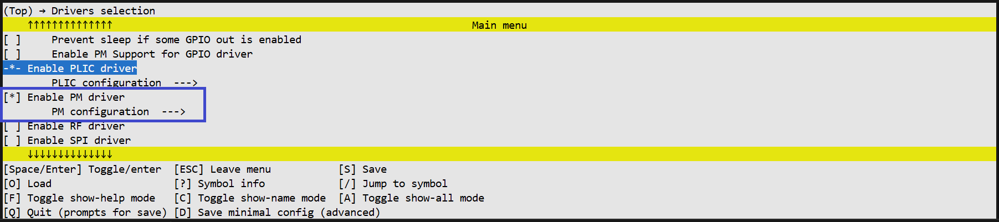
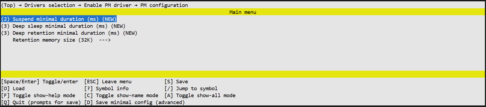

# PM Driver Documentation

## Overview
The PM (Power Management) driver provides an interface for controlling the microcontroller's power states. It allows the system to enter various low-power modes (Sleep) to save energy and defines how the system wakes up. The driver also manages retention memory and validates sleep durations against configured limits.

**Key Features:**
- Support for multiple sleep modes (Suspend, Deep Sleep, Deep Retention).
- Management of wakeup sources (GPIO Pad, Timer, Core, Comparator).
- Configurable sleep duration limits (minimum times).
- Configuration of retention memory size.
- Error handling for invalid sleep attempts (e.g., duration too short).


## Data Types and Enumerations
The following section describes the enumerations and data types used to configure and work with the PM driver.

### 1. Sleep Modes
**Enum:** `tlk_pm_sleep_mode`

Defines the available low-power states for the system.

| Items | Description |
| --- | --- |
| `TLK_PM_SLEEP_MODE_SUSPEND` | Standard low-power mode. Fast wake-up, keeps most context. |
| `TLK_PM_SLEEP_MODE_DEEP_SLEEP` | Lowest power consumption. SRAM is not retained and most peripherals are powered off. |
| `TLK_PM_SLEEP_MODE_DEEP_RETENTION` | Low power mode with SRAM retention. Higher power consumption than Deep Sleep, but state preservation. |


### 2. Wakeup Sources
**Enum:** `tlk_pm_wakeup_source`

Bitmask defines which hardware event triggered the system to wake up.

| Items | Description |
| --- | --- |
| `TLK_PM_WAKEUP_SOURCE_NONE` | No specific wakeup source detected. |
| `TLK_PM_WAKEUP_SOURCE_PAD` | System woke up via a GPIO pin (Pad). |
| `TLK_PM_WAKEUP_SOURCE_CORE` | System woke up via a Core event. |
| `TLK_PM_WAKEUP_SOURCE_TIMER` | System woke up via the System Timer. |
| `TLK_PM_WAKEUP_SOURCE_COMPARATOR` | System woke up via the Comparator. |


### 3. Sleep Status
**Enum:** `tlk_pm_sleep_status`

Defines the result of a sleep request.

| Items | Description |
| --- | --- |
| `TLK_PM_SLEEP_OK` | The system successfully entered and exited sleep. |
| `TLK_PM_SLEEP_UNSUPPORTED` | The requested sleep mode is not supported by the hardware. |
| `TLK_PM_SLEEP_TOO_SHORT` | The requested duration was shorter than the configured minimum (MS). |
| `TLK_PM_SLEEP_TOO_LONG` | The requested duration exceeded the hardware timer limits. |
| `TLK_PM_SLEEP_NO_WAKEUP_SOURCES` | Sleep was aborted because no wakeup sources were configured. |
| `TLK_PM_SLEEP_DENIED` | Sleep was denied (e.g., by a peripheral preventing sleep). |


### 4. GPIO Wakeup Level
**Enum:** `tlk_pm_gpio_wakeup_level`

Defines the logic level required on a GPIO pin to trigger a wakeup.

| Items | Description |
| --- | --- |
| `TLK_PM_GPIO_WAKEUP_LEVEL_LOW` | Wake up when the pin is Low (0). |
| `TLK_PM_GPIO_WAKEUP_LEVEL_HIGH` | Wake up when the pin is High (1). |


## API Reference
The following section describes the functions available in the PM driver.

### 1. `tlk_pm_sleep`
Requests the system to enter a specific low-power mode for a specific duration.

**Prototype:**

```c
enum tlk_pm_sleep_status tlk_pm_sleep(enum tlk_pm_sleep_mode mode,
                              uint32_t duration_us);

```

**Parameters:**

| Parameter | Type | Description |
| --- | --- | --- |
| `mode` | `enum tlk_pm_sleep_mode` | The desired low-power state. |
| `duration_us` | `uint32_t` | The duration to sleep in microseconds. |

**Return Value:**
`enum tlk_pm_sleep_status`: The result of the operation (e.g., `TLK_PM_SLEEP_OK` or error code).


### 2. `tlk_pm_set_gpio_wakeup`
*This API is available only if `CONFIG_TLK_GPIO` is enabled.*

Configures a specific GPIO pin as a wake-up source. The system will exit sleep mode when the selected pin detects the configured wake-up polarity (logic level).

**Prototype:**

```c
enum tlk_pm_sleep_status tlk_pm_set_gpio_wakeup(enum tlk_gpio_port port,
                                        enum tlk_gpio_pin pin,
                                        enum tlk_pm_gpio_wakeup_level polarity);

```

**Parameters:**

| Parameter | Type | Description |
| --- | --- | --- |
| `port` | `enum tlk_gpio_port` | GPIO port. |
| `pin` | `enum tlk_gpio_pin` | GPIO pin. |
| `polarity` | `enum tlk_pm_gpio_wakeup_level` | The logic level that triggers wakeup (`TLK_PM_GPIO_WAKEUP_LEVEL_LOW` or `HIGH`). |

**Return Value:**
`enum tlk_pm_sleep_status`: `TLK_PM_SLEEP_OK` if successful, or `TLK_PM_SLEEP_UNSUPPORTED` if the pin cannot be used as a wakeup source.


### 3. `tlk_pm_get_wakeup_reason`
Returns the source that caused the system to wake up from the last sleep cycle.

**Prototype:**

```c
enum tlk_pm_wakeup_source tlk_pm_get_wakeup_reason(void);

```

**Parameters:**
None

**Return Value:**
`enum tlk_pm_wakeup_source`: A bitmask indicating the wakeup source.


### 4. `tlk_pm_clear_wakeup_sources`
Clears the flags for wakeup sources. This should be called after handling the wakeup event to prepare for the next sleep cycle.

**Prototype:**

```c
void tlk_pm_clear_wakeup_sources(void);

```

**Parameters:**
None

**Return Value:**
None


## PM Configuration
This section describes the Power Management configuration options available in the Kconfig.

### Configurations

```text
TLK_PM_SUSPEND_MIN_DURATION_MS
│   Defines the minimum allowed duration for Suspend mode (in milliseconds).
│   If `pm_sleep` is called with a time shorter than this, it returns `TLK_PM_SLEEP_TOO_SHORT`.
│   Default: 2 ms
│
TLK_PM_DEEP_SLEEP_MIN_DURATION_MS
│   Defines the minimum allowed duration for Deep Sleep mode (in milliseconds).
│   Default: 3 ms
│
TLK_PM_DEEP_RETENTION_MIN_DURATION_MS
│   Defines the minimum allowed duration for Deep Retention mode (in milliseconds).
│   Default: 3 ms
│
TLK_PM_RETENTION_MEMORY_SIZE
│   Selects the size of the RAM to be retained during Deep Retention mode.
│   The available options (e.g., 16K, 32K) depend on the specific SoC capabilities.
```


### View in the menuconfig




*Figure 1-2. PM driver configurations*
