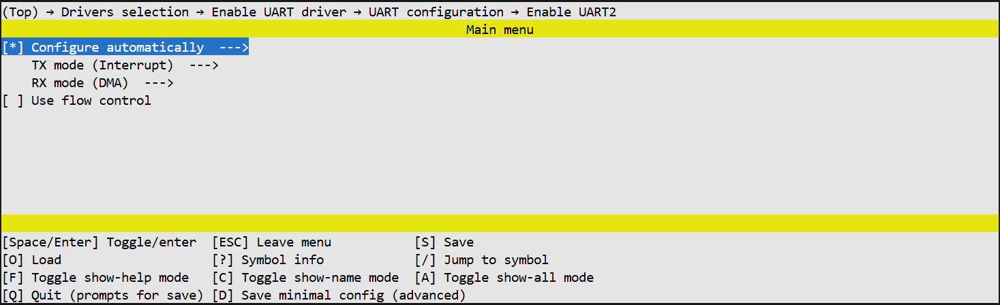
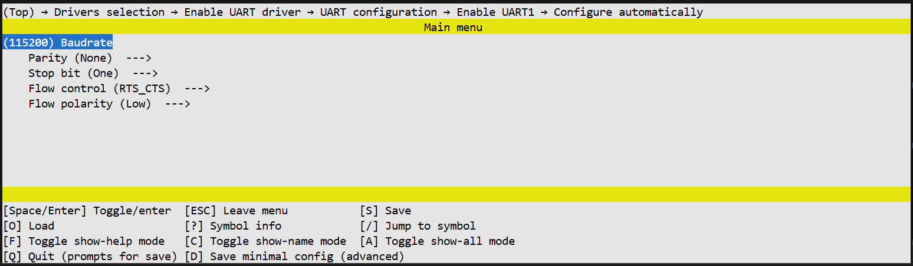

# UART Driver Documentation

## Overview
The UART (Universal Asynchronous Receiver-Transmitter) driver provides an interface for configuring and utilizing the microcontroller's asynchronous serial ports. The driver supports communication parameter initialization (baud rate, parity, stop bits), pin multiplexing (Pinmux), and blocking data transmission, as well as data reception in both blocking and non-blocking (interrupt-based) modes. It also supports hardware flow control.

**Key Features:**
- Configuration of UART parameters (Baudrate, Parity, Stop Bits).
- Pin multiplexing for TX/RX and RTS/CTS pins.
- Data transmission (blocking mode).
- Data reception (blocking mode or interrupt-driven with callback).
- Hardware Flow Control (RTS/CTS).


## Data Types and Enumerations
The following section describes the enumerations and data types used to configure and work with the UART driver.

### 1. Module Identification
**Enum:** `tlk_uart_module`

Defines the identifier for the UART instance. The number of available modules depends on the `UNISDK_UART_COUNT` configuration and the `DECLARE_UART_IF_ENABLED` macro.

| Items | Description |
| :--- | :--- |
| `UARTx` | UART module index (where x is the number, e.g., 0, 1, 2...). Generated automatically based on enabled instances. |


### 2. Parity Configuration
**Enum:** `tlk_uart_parity`

Defines the parity check mode for the UART frame.

| Items | Description |
| :--- | :--- |
| `TLK_UART_PARITY_NONE` | No parity check. |
| `TLK_UART_PARITY_EVEN` | Even parity check. |
| `TLK_UART_PARITY_ODD` | Odd parity check. |


### 3. Stop Bit Configuration
**Enum:** `tlk_uart_stop_bit`

Defines the number of stop bits in the UART frame. The values include specific bit shifts for register configuration.

| Items | Description |
| :--- | :--- |
| `TLK_UART_STOP_BIT_ONE` | 1 stop bit (Value 0). |
| `TLK_UART_STOP_BIT_ONE_DOT_FIVE` | 1.5 stop bits (Uses `TLK_BIT(4)`). |
| `TLK_UART_STOP_BIT_TWO` | 2 stop bits (Uses `TLK_BIT(5)`). |


### 4. Operation Status
**Enum:** `tlk_uart_status`

Return codes used by driver functions to indicate the result of an operation.

| Items | Description |
| :--- | :--- |
| `TLK_UART_OK` | Operation completed successfully. |
| `TLK_UART_TIMEOUT` | Operation timed out. |
| `TLK_UART_ERROR` | General execution error. |


### 5. Flow Control Modes
*This enum is available only if `CONFIG_TLK_UART_USED_FLOW_CONTROL` is enabled.*

**Enum:** `tlk_uart_flow_control`

| Items | Description |
| :--- | :--- |
| `TLK_UART_FLOW_NONE` | Flow control disabled. |
| `TLK_UART_FLOW_RTS` | RTS signal only. |
| `TLK_UART_FLOW_CTS` | CTS signal only. |
| `TLK_UART_FLOW_RTS_CTS` | Full RTS/CTS flow control. |


### 6. Flow Control Polarity
*This enum is available only if `CONFIG_TLK_UART_USED_FLOW_CONTROL` is enabled.*

**Enum:** `tlk_uart_flow_polarity`

Defines the active level logic for RTS and CTS signals.

| Items | Description |
| :--- | :--- |
| `TLK_UART_ACTIVE_LOW` | **Active Low.**<br>UART stops sending when CTS is low, and sets RTS low to stop receiving. |
| `TLK_UART_ACTIVE_HIGH` | **Active High.**<br>UART stops sending when CTS is high, and sets RTS high to stop receiving. |


### 7. Transmit Handler Type
**Type:** `tlk_uart_tx_handler_t`

A function pointer type for the callback function invoked by the driver when data transmission is complete in interrupt and dma modes.

```c
typedef void (*tlk_uart_tx_handler_t)(void);
```


### 8. Receive Handler Type
**Type:** `tlk_uart_rx_handler_t`

A function pointer type for the callback function invoked by the driver when data reception is complete in interrupt and dma modes.

```c
typedef void (*tlk_uart_rx_handler_t)(uint32_t rx_count);
```


## Driver APIs

### 1. `tlk_uart_configure`
Initializes the UART module with the provided baud rate, parity, and stop bit configuration.

**Prototype:**
```c
void tlk_uart_configure(enum tlk_uart_module uart_num,
                    uint32_t baudrate,
                    enum tlk_uart_parity parity,
                    enum tlk_uart_stop_bit stop_bit);
```

**Parameters:**

| Parameter   | Type               | Description |
|------------|--------------------|-------------|
| `uart_num` | `enum tlk_uart_module` | UART module index. |
| `baudrate` | `uint32_t`         | UART baud rate. |
| `parity`   | `enum tlk_uart_parity` | UART parity setting. |
| `stop_bit` | `enum tlk_uart_stop_bit` | UART parity setting. |

**Return Value:**
None


### 2. `tlk_uart_configure_pinmux`
Configures the GPIO pins used for UART transmission (TX) and reception (RX).

**Prototype:**
```c
void tlk_uart_configure_pinmux(enum tlk_uart_module uart_num,
                           struct tlk_gpio_port_pin tx_port_pin,
                           struct tlk_gpio_port_pin rx_port_pin);
```

**Parameters:**

| Parameter        | Type                    | Description |
|------------------|-------------------------|-------------|
| `uart_num`       | `enum tlk_uart_module`      | UART module index. |
| `tx_port_pin`    | `struct tlk_gpio_port_pin`  | TX port and pin. |
| `rx_port_pin`    | `struct tlk_gpio_port_pin`  | RX port and pin. |

**Return Value:**
None


### 3. `tlk_uart_send_bytes`
1. If blocking mode is enabled, the function performs blocking transmission until the buffer is fully sent or the timeout expires.
2. If interrupt or dma modes are enabled, the function stores the buffer information. The provided handler is called when transmission is complete.

**Prototype:**
```c
enum tlk_uart_status tlk_uart_send_bytes(enum tlk_uart_module uart_num,
                                const uint8_t *buff,
                                uint32_t buff_size,
                                tlk_uart_tx_handler_t tx_handler,
                                uint32_t timeout_us);
```

**Parameters:**

| Parameter      | Type               | Description |
|----------------|--------------------|-------------|
| `uart_num`     | `enum tlk_uart_module` | UART module index. |
| `buff`         | `const uint8_t *`  | Pointer to the transmit buffer. |
| `buff_size`    | `uint32_t`         | Number of bytes to send. |
| `tx_handler`   | `tlk_uart_tx_handler_t` | Callback function called after transmission completion in interrupt and dma modes. |
| `timeout_us`   | `uint32_t`         | Timeout value in microseconds for blocking mode. |

**Return Value:**

| Value | Description |
|-------|-------------|
| `TLK_UART_OK` | Transmission completed successfully. |
| `TLK_UART_TIMEOUT` | Transmission did not complete before the timeout expired. |
| `TLK_UART_ERROR` | Transmission failed due to an error. |


### 4. `tlk_uart_receive_bytes`
Receives a data buffer over UART.

1. If blocking mode is enabled, the function performs blocking reception until the buffer is filled or the timeout ends.
2. If interrupt or dma modes are enabled, the function stores the buffer information. The provided handler is called when reception is complete.

**Prototype:**
```c
enum tlk_uart_status tlk_uart_receive_bytes(enum tlk_uart_module uart_num,
                                        const uint8_t *buff,
                                        uint32_t buff_size,
                                        tlk_uart_rx_handler_t rx_handler,
                                        uint32_t timeout_us);
```

**Parameters:**

| Parameter     | Type                  | Description |
|---------------|-----------------------|-------------|
| `uart_num`    | `enum tlk_uart_module`    | UART module index. |
| `buff`        | `uint8_t *`           | Pointer to the receive buffer. |
| `buff_size`   | `uint32_t`            | Number of bytes to receive. |
| `rx_handler`  | `tlk_uart_rx_handler_t`   | Callback function called after reception completion in interrupt and dma modes. |
| `timeout_us`  | `uint32_t`            | Timeout value in microseconds for blocking mode. |

**Return Value:**

| Value | Description |
|-------|-------------|
| `TLK_UART_OK` | Reception completed successfully. |
| `TLK_UART_TIMEOUT` | Reception did not complete before the timeout expired. |
| `TLK_UART_ERROR` | Reception failed due to an error. |


### 5. `tlk_uart_configure_flow_control`
*This API is available only if `CONFIG_TLK_UART_USED_FLOW_CONTROL` is enabled.*

Configure the flow control for the specified UART module.
Disabled by default. Should be called after the uart_configure.

**Prototype:**
```c
void tlk_uart_configure_flow_control(enum tlk_uart_module uart_num,
                         enum tlk_uart_flow_control flow_control,
                         enum tlk_uart_flow_polarity flow_polarity);
```

**Parameters:**

| Parameter        | Type                     | Description |
|------------------|--------------------------|-------------|
| `uart_num`       | `enum tlk_uart_module`       | UART module index. |
| `flow_control`   | `enum tlk_uart_flow_control` | Hardware flow control mode. |
| `flow_polarity`  | `enum tlk_uart_flow_polarity`| Flow control polarity for RTS/CTS signals |

**Return Value:**
None


### 6. `tlk_uart_configure_flow_control_pinmux`
*This API is available only if `CONFIG_TLK_UART_USED_FLOW_CONTROL` is enabled.*

Configure UART RTS and CTS pin multiplexing.
Configures the GPIO pins used for UART flow control signals RTS (Request To Send) and CTS (Clear To Send).

**Prototype:**
```c
void tlk_uart_configure_flow_control_pinmux(enum tlk_uart_module uart_num,
                                struct tlk_gpio_port_pin rts_port_pin,
                                struct tlk_gpio_port_pin cts_port_pin);
```

**Parameters:**

| Parameter        | Type                   | Description |
|------------------|------------------------|-------------|
| `uart_num`       | `enum tlk_uart_module`     | UART module index. |
| `rts_port_pin`   | `struct tlk_gpio_port_pin` | RTS port and pin. |
| `cts_port_pin`   | `struct tlk_gpio_port_pin` | CTS port and pin. |

**Return Value:**
None


## UART Configuration
This section describes UART configuration options.

### Global options

**`TLK_UART_SELECTED`**  
Indicates that at least one UART instance is enabled in the system.
This option is automatically selected when any `UART{i}_ENABLED` option is enabled.

**`TLK_UART_USED_AUTO_CONFIG`**  
Indicates that automatic UART configuration is enabled in the system.
This option is automatically selected when `UART{i}_AUTO_CONFIG` is enabled for any UART instance.

**`TLK_UART_USED_IRQ`**  
Indicates that at least one UART instance needs a PLIC functionality
This option is automatically selected when `UART{i}_USED_IRQ` or `UART{i}_USED_DMA` are enabled for any UART instance.

**`TLK_UART_USED_DMA`**  
Indicates that at least one UART instance needs a DMA functionality
This option is automatically selected when `UART{i}_USED_DMA` is enabled for any UART instance.

**`TLK_UART_USED_PM_DEVICE`**  
Indicates that UART power management support is enabled in the system.
This option is automatically selected when `UART{i}_PM_DEVICE` is enabled for any UART instance.

**`TLK_UART_USED_FLOW_CONTROL`**  
Indicates that hardware flow control (RTS/CTS) is enabled in the system.
This option is automatically selected when `UART{i}_FLOW_CONTROL` is enabled for any UART instance.


### Configurations

```text
UART{i}_ENABLED
│   Enables the specific UART module.
│
├── UART{i}_AUTO_CONFIG
│   │   Enables automatic driver configuration using the values below.
│   │
│   ├── UART{i}_BAUDRATE
│   │       Sets the communication speed in baud (Default: 115200).
│   │
│   ├── UART{i}_PARITY
│   │   │   Configures the parity check mode for the UART frame.
│   │   ├── TLK_UART_PARITY_NONE      (Default: No parity)
│   │   ├── TLK_UART_PARITY_EVEN      (Even parity)
│   │   └── TLK_UART_PARITY_ODD       (Odd parity)
│   │
│   ├── UART{i}_STOP_BIT
│   │   │   Sets the number of stop bits in a frame.
│   │   ├── TLK_UART_STOP_BIT_ONE           (Default: 1 bit)
│   │   ├── TLK_UART_STOP_BIT_ONE_DOT_FIVE  (1.5 bits)
│   │   └── TLK_UART_STOP_BIT_TWO           (2 bits)
│   │
│   ├── UART{i}_FLOW_CONTROL_TYPE
│   │   │   Selects the hardware flow control mode.
│   │   ├── TLK_UART_FLOW_NONE      (0) - Disabled
│   │   ├── TLK_UART_FLOW_RTS       (1) - RTS only
│   │   ├── TLK_UART_FLOW_CTS       (2) - CTS only
│   │   └── TLK_UART_FLOW_RTS_CTS   (3) - Full RTS/CTS
│   │
│   └── UART{i}_FLOW_POLARITY
│       │   Defines the active logic level for RTS/CTS signals.
│       ├── TLK_UART_ACTIVE_LOW     (0) - Active Low (Default)
│       └── TLK_UART_ACTIVE_HIGH    (1) - Active High
│
├── UART{i}_TX_MODE
│   │   Sets the transmission mode
│   ├── TLK_UART_XFER_BLOCKING   Blocking mode, wich will use the timeout
│   ├── TLK_UART_XFER_IRQ       Interrupt mode, wich will automatically replenish the TX fifo on interrupts
│   └── TLK_UART_XFER_DMA        DMA mode, wich will automatically replenish the TX fifo by DMA channel
│
├── UART{i}_RX_MODE
│   │   Sets the reception mode
│   ├── TLK_UART_XFER_BLOCKING   Blocking mode, wich will use the timeout
│   ├── TLK_UART_XFER_IRQ       Interrupt mode, wich will automatically read the RX fifo on interrupts
│   └── TLK_UART_XFER_DMA        DMA mode, wich will automatically read the RX fifo by DMA channel
│
├── UART{i}_PM_DEVICE
│       Enables Power Management support for the device (saving and restoring data, before/after sleep).
│
└── UART{i}_PREVENT_SLEEP
        Prevents system sleep mode while UART is actively receiving.

TLK_DEBUG_PRINT
│   Enables debug output for UART communication.
│
├── TLK_DEBUG_PRINT_UART
│       Selects which UART instance(s) will output debug messages.
│
└── TLK_DEBUG_PRINT_BUFFER_SIZE
        Sets the buffer size for debug messages (Default: 256 bytes).
```


### View in the menuconfig


*Figure 1. UART driver configurations*


*Figure 2. UART instance configurations*


*Figure 3. UART instance auto-config options*


*Figure 4. UART debug configurations*
