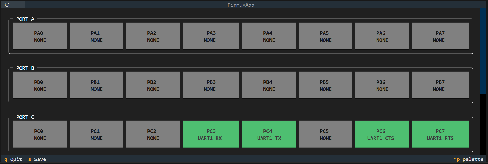
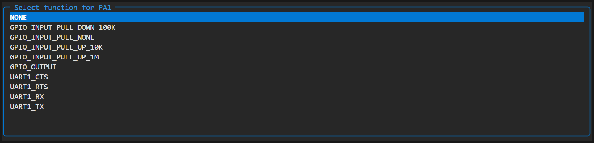
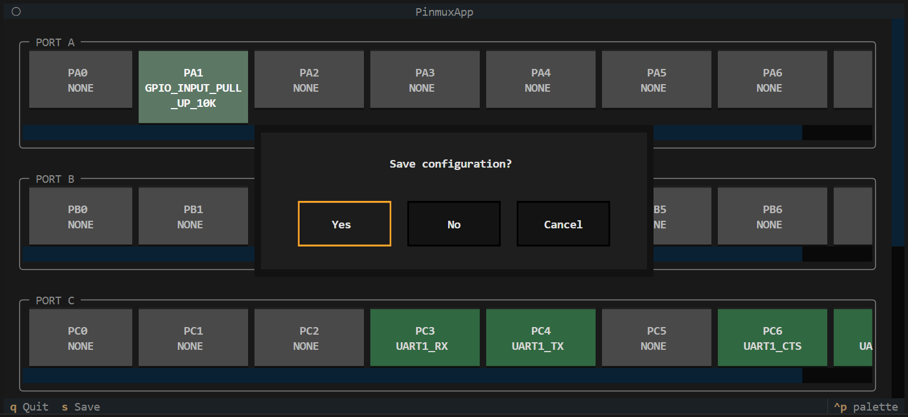

# Pinmux Interface Documentation

## Overview
The Pinmux Interface is a terminal-based user interface used to configure GPIO pin multiplexing for a specific SoC. It allows developers to assign hardware functions (such as UART, SPI, I2C) to physical GPIO pins.  
The tool ensures that pin assignments match the current system configuration and enabled hardware modules.

**Key Features:**
- Visual Interface: Provides a terminal-based graphical view of all GPIO ports and their specific pins.
- Interactive Configuration: Allows users to easily select and assign hardware functions to pins via a popup menu.
- Conflict Detection: Automatically prevents saving if multiple pins are assigned conflicting hardware resources.
- Requirement Validation: Ensures that all functions required by the current configuration are assigned to a valid pin.
- Configuration Sync: Performs startup check to verify that the current system configuration has valid up-to-date pin settings.
- Simple Export: Saves the final pin mapping to a .pinmux file using the custom Kconfig-like format.
- Defaults Overriding: Allows to introduce the custom project-specific pin settings.


## Usage

### 1. Launching the Interface
To open the configuration tool, run the following command in your terminal:

```bash
make pinmux
```
or
```bash
python -m scripts.pinmux
```

This will perform a system check and load the graphical interface.


### 2. Main View
Once opened, you will see the main dashboard:

- **Ports:**  
  A scrollable vertical list of all GPIO ports (e.g., PORT A, PORT B).

- **Pins:**  
  Inside each port section, individual pins are displayed as interactive buttons. Each button shows the pin's name and its currently assigned function.


*Figure 1. Pinmux Interface overview showing GPIO ports, pins, and assigned functions.*


### 3. Selecting a Function
To assign or change a function on a pin:

1. Click on the specific pin (or navigate to it and press **Enter**).
2. A popup window titled **Function Select** will appear.
3. This list shows all supported hardware functions for that specific pin.
4. Select the desired function (e.g., `UART0_RX`) or select **NONE** to disable the pin.
5. Press **Enter** to confirm.


*Figure 2. Function select screen for a GPIO pin.*


### 4. Shortcuts
You can use keyboard shortcuts for quick actions:

- **s (Save):**  
  The system checks for errors (conflicts or missing required functions).
  - If valid: Saves changes and exits.
  - If invalid: Shows an error notification and returns you to the editor to fix it.
  - A validation error will occur if:
    - Necessary functions are not assigned to pins (e.g., if **UART0** is enabled in configuration, but **UART0_TX** is not assigned to any pin).
    - Conflicting pins exist (e.g., **UART0_TX** assigned to both **PC3** and **PC4** simultaneously).

- **q (Quit):**  
  - Tries to exit from the app.
  - A confirmation dialog appears automatically when you try to quit if you have any pin assignments modified or invalidated.


*Figure 3. Exit Screen.*


### 5. Saving
The final configuration is saved to a file with a name identifying which configuration it belongs to. The format is `<SoC or board name>.<soc or board>.pinmux`. For example, if you are building for the TL3218X_EVK board, the file will be named `TL3218X_EVK.board.pinmux`.

This `.pinmux` file contains pin-to-function mappings in a human-readable format and is used to restore previous pin settings when the tool is invoked again.

Additionally, `pinmux.h` is generated in the build folder based on the saved settings. This header file contains C preprocessor definitions that can be used by firmware code.

The `.pinmux` files persist until the project switches, allowing previous pin settings to be restored when switching between chips.


### 6. File format
The `.pinmux` files use a simple key-value format. Each line represents a single pin assignment. All letters are upper-case. The format is: `<pin name>=<function name>`, where **pin name** consists of the **letter P, port letter, and pin number**.

Example: To assign the **UART0_TX** function to **pin 4** of **port C**, write:
```
PC4=UART0_TX
```

Each physical pin is unique and can only have one function assigned. However, functions may repeat on different pins depending on the function type (e.g., **GPIO_OUTPUT** can be assigned to multiple pins).

During parsing, the following lines are **ignored**:
- Invalid data that doesn't match the pattern.
- Valid data referencing non-existent pins or functions.
- Assignments to pins on ports disabled in the current configuration.
- Assignments to functions not enabled in the current configuration.

Feel free to include assignments that may be unused in specific configurations—they will be safely ignored.


### 7. Overriding mechanism
Each time the pinmux is invoked, the data is loaded in the following sequence:
1. SoC defaults, described in the `soc/<soc>/pinmux/function.yaml`. Mostly used for the development.
2. `.pinmux` file in the project directory (if present). Used to set own default pin settings for any chip in the current project.
3. `<identifier>.pinmux` file in the project directory, which represents some chip-specific configuration (if present). Used to override the settings for exact specific chip in **identifier** (f.e., some widely-used pin is not present on the specific board).
4. `<identifier>.pinmux` file in the build directory (if present). Represents the last actual user's pin settings.

Each loaded settings overrides the previous one, f.e., if the **UART0_TX** is assigned to **PC4** by the SoC default, but in the project's `.pinmux` it is assigned to **PB0**, after the overriding it will be assigned to the latest **PB0**. The described sequence allows to make the projects with the out of the box pin settings, still allowing to customize it.


## Internal Execution Flow
This section explains how data moves through the application: from loading files to generating the final C header.

### 1. Data Loading & Synchronization
When the application starts, it combines multiple different sources of data to build the interface.

**The Sources:**

- `soc/<soc>/pinmux/pinmux.yaml`: The "Dictionary". It lists every physical pin and what functions it can support. Each port can have an `exclude` property, which describes what functions aren't supported by its pins. Individual pins can also use `exclude` and `include` properties. The restrictions are applied in the following order: port's exclude → pin's exclude → pin's include. For simplicity, the `all` keyword represents all functions. For groups of functions, you may use a group name (e.g., `uart0` represents `uart0_tx`, `uart0_rx`, `uart0_cts`, and `uart0_rts`; `uart` covers `uart0`, `uart1`, etc.). If a pin supports only one exact function, use `exclude: all` together with `include: your_function`.
- `soc/<soc>/pinmux/pinmux_<case>.yaml`: The "Restriction". Overrides the previous `.../pinmux.yaml`. Mainly used to remove the pins or entire ports, considering the chip case pinout, by assigning to them `delete` keyword.
- `.config`: The "Requirements". It tells the app which drivers are enabled (e.g., "TLK_UART0 is enabled, so we need pins for TX and RX").
- Other files, described in the [Overriding mechanism](#7-overriding-mechanism) section.

**The Loading Sequence:**

- The `.config` file, which contains the current configuration and identifies the current chip.
- The function description from `.../function.yaml`, skipping functions disabled by configuration.
- The port and pin description from `.../pinmux.yaml` and `.../pinmux_<case>.yaml` for the selected chip.
- The `.pinmux` files in the order described in the [Overriding mechanism](#7-overriding-mechanism) section.

### 2. Changing a Pin Function
When you select a new function for a pin in the UI, the following happens instantly:

- **Collision Check:** The system scans all other pins. If you try to assign a unique function (like `UART0_TX`) to PC0, but PB2 already has it, the system flags a **Conflict**.
- **Observer Update:** The app uses an "Observer Pattern."
  - The Pin data changes.
  - The UI widget receives a notification and redraws itself (updating the text and color).
  - The next `is_modified` property access in `PinmuxManager` will return True, until the save action will be triggered.


### 3. The Saving Process
When you press Save (`s`), the app performs strict validation before writing to disk.

**Step 1: Validation**

- **Check Conflicts:** Are two pins assigned to the same non-repeatable function? If yes → Error.
- **Check Requirements:** Are all functions required by the configuration assigned to valid pins? If no → Error.

**Step 2: Writing**

- If there are no errors, the pin mapping is saved to the `<identifier>.pinmux` file using the simple key-value format:

```
PC4=UART0_TX
PB2=UART0_RX
PA0=GPIO_OUTPUT
```


### 4. Generating pinmux.h
After saving, a C header file is automatically generated to make your configuration usable by firmware code.

**Input:** The in-memory `PinmuxData` object containing all pin assignments.

**Process:**

- For each assigned function, generates C preprocessor definitions.
- For repeatable functions (e.g., GPIO_OUTPUT), creates indexed macros.
- Creates port and pin definitions using TLK naming conventions.

**Output:** Creates `build/pinmux.h`.

**Example Output:**

```c
#define PINMUX_UART0_TX_PORT TLK_GPIO_PORT_C
#define PINMUX_UART0_TX_PIN TLK_GPIO_PIN_4
#define PINMUX_UART0_RX_PORT TLK_GPIO_PORT_B
#define PINMUX_UART0_RX_PIN TLK_GPIO_PIN_2
#define PINMUX_GPIO_OUTPUT_0_PORT TLK_GPIO_PORT_A
#define PINMUX_GPIO_OUTPUT_0_PIN TLK_GPIO_PIN_0
#define PINMUX_GPIO_OUTPUT_COUNT 1
```

## CI
The CI uses a single configuration across all samples. It is possible, because unused assignment are skipped, so you need just consider all pin usages in the samples at this file. Before the build, it copies this file to the build directory, and since during the overriding, the build's settings is applied last, the resulting configuration will correspond to the described in the file, because all previous settings will be overrided.
