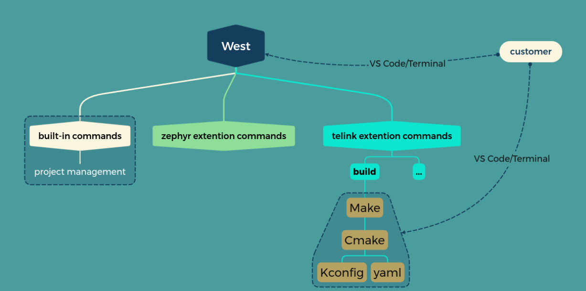
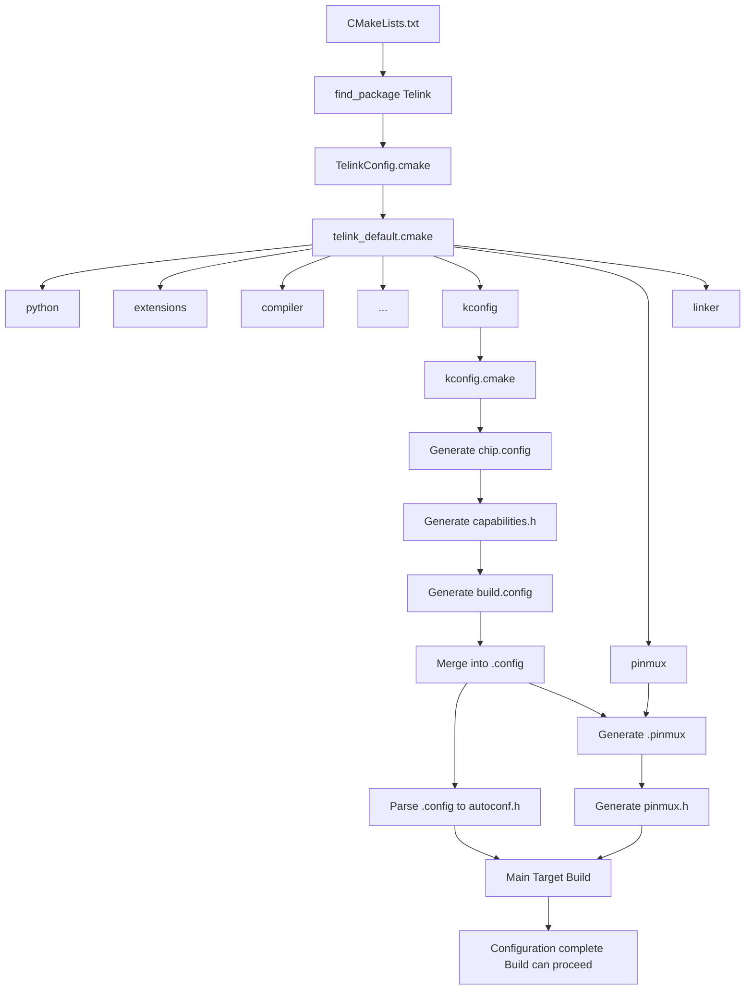
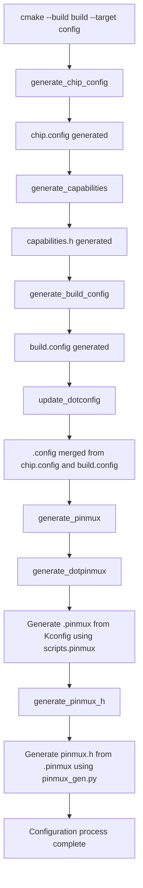
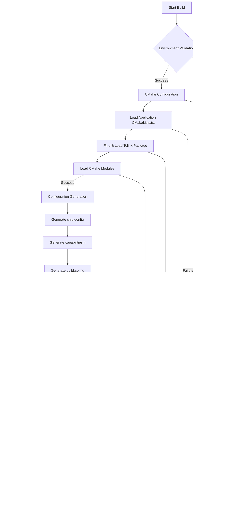

# UniSDK Build System Architecture Documentation

## 1. Overall Architecture Overview

The UniSDK build system adopts a modular, extensible architecture design that integrates multiple tools such as Make, CMake, Ninja, West, and Kconfig to form a complete compilation and build workflow. The system supports multiple compilation methods, including West commands, direct CMake calls, and Make commands, providing developers with flexible build options.

### 1.1 Core Components

- **CMake**: The main build system responsible for project configuration, dependency management, and build process definition
- **Ninja**: A high-performance build tool that executes actual compilation tasks as CMake's backend
- **West**: Zephyr project management tool extended in UniSDK to manage project and simplify build workflows
- **Kconfig**: Configuration management system for handling compile-time configuration options
- **Make**: Provides a traditional make command interface as a frontend to CMake

### 1.2 Directory Structure

Build system-related files are mainly distributed in the following directories:

```
unisdk/
├── CMakeLists.txt         # Main CMake configuration file
├── Makefile               # Make command interface
├── west.yml               # West workspace configuration
├── Kconfig.chip           # Chip-related Kconfig configuration entry
├── Kconfig.build          # Build-related Kconfig configuration entry
├── cmake/                 # CMake modules and configurations
│   ├── modules/           # Core CMake modules
│   └── TelinkConfig.cmake # Telink CMake configuration
├── scripts/               # Build-related scripts
│   ├── ci/                # CI/CD related scripts
│   │   ├── ci_build.sh    # CI build script for single project
│   │   └── ci_build_all.sh # CI build script for all projects
│   ├── pinmux/            # Pinmux configuration tools
│   │   ├── __init__.py    # Pinmux module initialization
│   │   ├── __main__.py    # Pinmux CLI entry point
│   │   ├── app.py         # Pinmux application core
│   │   ├── data/          # Pinmux data files
│   │   ├── styles.tcss    # Pinmux UI styles
│   │   └── ui/            # Pinmux UI components
│   ├── pre_build/         # Pre-build check scripts
│   │   ├── build_folder_check.py # Build folder validation
│   │   ├── config_check.py # Configuration validation
│   │   ├── pinmux_check.py # Pinmux configuration validation
│   │   └── pre_build_check.py # Main pre-build check script
│   ├── west_commands/     # West command implementations
│   ├── kconfig.py         # Kconfig processing script
│   ├── menuconfig.py      # Interactive configuration interface
│   ├── preprocess_kconfig.py # Kconfig preprocessing script
│   ├── set_telink_base.cmd # Set TELINK_BASE (Windows CMD)
│   ├── set_telink_base.ps1 # Set TELINK_BASE (Windows PowerShell)
│   ├── set_telink_base.sh # Set TELINK_BASE (Linux/Mac)
│   ├── tlk_check_fw.py  # Firmware validation script
│   ├── west-commands.yml  # West command configuration
│   └── windows_setup.ps1  # Windows environment setup script
├── core/                  # Core code
├── soc/                   # Chip support code
├── boards/                # Development board support
└── docs/                  # Documentation
```
### 1.3 Build System

The UniSDK build system is a comprehensive framework that combines multiple tools to provide a seamless development experience. The following diagram illustrates the overall architecture and toolchain relationships:



The build system is designed around the following key components:

- **West**: The command-line interface for developers, providing a unified entry point for various build operations
- **Make**: Handles high-level build orchestration and pre-build checks
- **CMake**: Core build system responsible for project configuration, dependency management, and build rule generation
- **Kconfig**: Configuration management system for handling compile-time options
- **YAML**: Configuration format used for various system configurations, including pin multiplexing

This architecture enables a flexible and modular build process, allowing developers to easily configure, build, and manage their projects while maintaining consistency across different target platforms.


## 2. CMake Build System

### 2.1 CMake Core Process

The CMake build system is the core of the UniSDK compilation process, responsible for project configuration, dependency resolution, and build rule generation.

#### 2.1.1 Initialization Phase

1. **Entry Point**: The build system supports **two entry point modes**:
   - **Root Directory Entry**: Uses the root directory's `CMakeLists.txt` as the entry point to build the entire SDK
   - **Application Entry**: Uses an application-level `CMakeLists.txt` (typically located in the `samples/` directory) as the entry point to build a specific application
2. **Version Requirements**: Sets the minimum CMake version (3.20.0)
3. **SDK Integration**: Locates and loads the Telink package configuration through `find_package(Telink REQUIRED HINTS $ENV{TELINK_BASE})`
4. **Project Setup**: Configures project-specific settings, including project name, supported languages, and target creation

**Key Include Guards:**
The build system uses two important include guards to manage inclusion and prevent redundant processing:

1. **TELINK_ROOT_INCLUDED**:
   - Set to `TRUE` in the root directory's `CMakeLists.txt`
   - Used by `telink_default.cmake` to determine if the root directory has already been included
   - If not defined, `telink_default.cmake` will include the root directory's `CMakeLists.txt`
   - It will be removed in future versions when the application-level CMakeLists.txt is supported as the entry point.

2. **TELINK_PACKAGE_INCLUDED**:
   - Set to `TRUE` in `TelinkConfig.cmake` when the Telink package is loaded
   - Prevents multiple loading of the Telink package configuration
   - Checked in the root directory's `CMakeLists.txt` to avoid redundant package loading

**Entry Point Modes Comparison:**

| Mode | Entry Point | Usage | Output |
|------|-------------|-------|--------|
| **Root Directory Entry** | `CMakeLists.txt` (root) | `cmake -B build -G Ninja .` | Builds the entire SDK as a library |
| **Application Entry** | `CMakeLists.txt` (samples/<AppName>) | `cmake -B build -G Ninja samples/gpio_demo` | Builds a specific application executable |

**Application-Level Entry Point Implementation:**
All applications in the `samples/` directory must provide their own `CMakeLists.txt` file, which serves as the entry point for the build process when building a specific application. This file should:

1. Set the minimum CMake version
2. Define the project name and default language (C)
3. Add C sources using wildcards
4. Create an executable target
5. Conditionally add C++ support if CONFIG_TLK_ALLOW_CPP_WRAPPERS is enabled

The application-level CMakeLists.txt is automatically processed by the build system (via Make or West commands), which handles the integration with the core SDK components.

#### 2.1.2 Module Loading Phase

`telink_default.cmake` loads all necessary CMake modules in a specific order:

```cmake
list(APPEND telink_cmake_modules python)
list(APPEND telink_cmake_modules extensions)
list(APPEND telink_cmake_modules west)
list(APPEND telink_cmake_modules compiler)
list(APPEND telink_cmake_modules kconfig)
list(APPEND telink_cmake_modules pinmux)
list(APPEND telink_cmake_modules linker)
```

Each module is responsible for the configuration and implementation of specific functionality, together forming a complete build system.

### 2.2 Core CMake Modules

#### 2.2.1 python.cmake

This module is from the Zephyr project.

The `python.cmake` module is responsible for configuring and validating the Python environment required by the UniSDK build system. As the first module loaded in the build process, it ensures that all Python-dependent components have a consistent and compatible Python environment.

**Key Features and Functionality:**

1. **UTF-8 Encoding Configuration**
   - Sets `PYTHONIOENCODING` to "utf-8" on Windows systems
   - Ensures consistent output encoding when Python scripts are executed by CMake
   - Prevents encoding issues that could occur when Python isn't connected to a terminal

2. **Python Version Management**
   - Defines a minimum required Python version (3.10)
   - Implements a robust Python executable discovery mechanism
   - Prioritizes using the same Python interpreter as West when available

3. **Python Discovery Process**
   - Checks for an existing `Python3_EXECUTABLE` variable first
   - Falls back to using `WEST_PYTHON` if available
   - Searches for "python" and "python3" executables in the system path and virtual environments
   - Verifies discovered Python versions meet the minimum requirements
   - Rejects Python 2.x installations explicitly

4. **Integration with CMake**
   - Uses `find_package(Python3)` to finalize Python configuration
   - Sets the legacy `PYTHON_EXECUTABLE` variable for compatibility with scripts expecting this variable
   - Uses `include_guard(GLOBAL)` to prevent multiple inclusions

This module ensures that all Python scripts used throughout the build process (such as Kconfig processing, pinmux generation, and build utilities) have access to a compatible Python interpreter, providing a consistent build environment across different platforms.

#### 2.2.2 compiler.cmake

The `compiler.cmake` module is one of the core modules of the UniSDK build system, responsible for configuring the compiler toolchain, compiler options, and compilation flags. This module provides a complete RISC-V compiler configuration and management mechanism.

**Key features include:**

1. **Compiler Environment Detection and Configuration**
   - Automatically detects the TELINK_TOOLCHAIN_PATH environment variable setting
   - Supports cross-platform path handling
   - Verifies the existence and validity of the RISC-V GCC compiler
   - Provides clear error messages and configuration guidance when the compiler is not found

2. **Toolchain Component Setup**
   - Configures primary compilation tools: C/C++ compiler, assembler
   - Sets up auxiliary tools: objdump, objcopy, etc.
   - Uniformly configures RISC-V target architecture and processor type
   - Sets the system name to Generic (for bare-metal development)

3. **Compiler Options Application Function**
   - Provides the `telink_apply_compiler_options()` function to apply compilation options to targets
   - Automatically applies preprocessor macro definitions (autoconf.h, capabilities.h, pinmux.h)
   - Supports dynamically loading compilation options from JSON configuration files
   - Applies specific compilation flags based on different languages (ASM, C, C++)

This module ensures compilation consistency across different platforms for the entire project through a unified compiler configuration mechanism, while providing a flexible option configuration method to support project customization requirements.

#### 2.2.3 linker.cmake

The `linker.cmake` module is responsible for configuring the linking process in the UniSDK build system. It handles linker scripts, link options, and post-build processing commands. The following are its key functionalities:

##### 2.2.3.1 Basic Linker Configuration
- Sets CMAKE_C_LINK_EXECUTABLE command template for RISC-V cross-compilation
- Configures verbose makefile output for better build visibility
- Disables RPATH to ensure no runtime path dependencies are embedded
- Removes default library suffix to match embedded system requirements

##### 2.2.3.2 Linker Options Management
- Reads linker options from the `build_settings.json` configuration file
- Converts JSON-defined linker options into CMake-compatible list format
- Adds essential linker flags

The `build_settings.json` file is a central configuration file used by the UniSDK build system to store various build-related settings. It follows a JSON format and contains platform-specific configuration options, including:

```json
{
    "linker_options": [
      "--gc-sections",
      "--print-memory-usage"
    ]
    "c_compile_options": [
        "-O2",
        "-Wall"
    ],
}
```

This file provides a flexible way to configure build settings across different platforms and projects, allowing for easy customization without modifying CMake scripts directly.

##### 2.2.3.3 Linker Script Preprocessing
- Implements preprocessing of linker scripts using the C compiler
- Supports conditional compilation in linker scripts using capabilities.h and autoconf.h macros
- Creates a custom target `preprocess_linker` that ensures the linker script is always up-to-date
- Automatically processes the base flash_boot.link script and outputs the final linker script to the build directory

##### 2.2.3.4 Post-Build Processing
- Provides the `telink_apply_linker_options(target)` function to apply linker settings to a specific target
- Configures objcopy to generate binary firmware files from ELF executables
- Sets up objdump to create assembly listings for debugging and analysis
- Adds size reporting to monitor memory usage of the compiled firmware
- Integrates firmware validation through the tlk_check_fw.py script

#### 2.2.4 kconfig.cmake

Kconfig integration module is responsible for managing the entire configuration system within the CMake build process:

- **Configuration File Management**:
  - Defines key configuration file paths (`.config`, `chip.config`, `build.config`, `autoconf.h`, `capabilities.h`)
  - Sets up build directory properties to ensure proper cleanup of configuration files
  - Manages configuration file regeneration and dependencies

- **Configuration Generation Flow**:
  - Handles automatic generation of `chip.config` from `Kconfig.chip` when SOC and BOARD are not defined
  - Generates `capabilities.h` using preprocessing script based on chip configuration
  - Creates `build.config` from `Kconfig.build` with dependencies on capabilities
  - Merges `chip.config` and `build.config` into the final `.config` file

- **Preprocessor Integration**:
  - Integrates Python scripts (`menuconfig.py`, `preprocess_kconfig.py`, `kconfig.py`)
  - Parses `.config` file to generate `autoconf.h` with appropriate C defines
  - Handles different value types (boolean, string, numeric) in configuration

- **Custom Targets**:
  - **`parse_config`**: Ensures configuration parsing during build
  - **`config`**: Unified target executing the entire configuration flow in sequence
  - **`generate_chip_config`**: Generates `chip.config` using menuconfig or kconfig.py
  - **`generate_capabilities`**: Generates `capabilities.h` from chip configuration
  - **`generate_build_config`**: Generates `build.config` using menuconfig or kconfig.py
  - **`update_dotconfig`**: Merges `chip.config` and `build.config` into `.config`

- **Dependency Tracking**:
  - Sets up explicit target dependencies: `generate_chip_config` → `generate_capabilities` → `generate_build_config` → `update_dotconfig`
  - Creates cross-platform CMake commands for configuration file operations
  - Manages the configuration generation order with proper dependencies

##### 2.2.4.1 SOC and BOARD Parameter Processing

The `kconfig.cmake` module includes comprehensive SOC and BOARD parameter handling:

**Parameter Detection and Processing:**
```cmake
# Process SOC and BOARD parameters if provided
if(DEFINED SOC)
  message(STATUS "SOC parameter detected: ${SOC}")
  set(SOC_CONFIG_ARG "SOC=${SOC}")
else()
  set(SOC_CONFIG_ARG "")
endif()

if(DEFINED BOARD)
  message(STATUS "BOARD parameter detected: ${BOARD}")
  set(BOARD_CONFIG_ARG "BOARD=${BOARD}")
else()
  set(BOARD_CONFIG_ARG "")
endif()
```

**SOC/BOARD Combination Validation:**
- Validates SOC and BOARD combinations using dynamic Kconfig parsing
- Extracts SOC and BOARD names from command-line arguments
- Calls `kconfig_parser.py` with `--validate` option to verify compatibility
- Provides clear error messages for invalid combinations

**Automatic Configuration Application:**
- Applies SOC and BOARD configurations using `soc_board_setter.py` script
- Handles dependency resolution automatically (BOARD dependencies trigger SOC configuration)
- Supports both individual SOC/BOARD setting and combined setting
- Integrates with the existing configuration generation flow

**Integration Points:**
- **Command Line**: Parameters passed via `-DSOC=` and `-DBOARD=` CMake flags
- **Make Integration**: Makefile automatically forwards SOC and BOARD variables to CMake
- **West Integration**: West commands can specify SOC/BOARD through command-line options
- **Validation**: Real-time validation prevents incompatible hardware configurations

#### 2.2.5 west.cmake

This module is from the Zephyr project.

The `west.cmake` module is responsible for integrating the West build system tool with the UniSDK build infrastructure. West is the official meta-tool for Zephyr-based projects, and this module ensures proper configuration and version compatibility within the UniSDK environment.

##### 2.2.5.1 West Installation Detection
- Checks for West installation by attempting to import the west.version module
- Verifies installation status through the presence of WEST_PYTHON environment variable
- Handles both installed and non-installed West scenarios gracefully
- Provides clear error messages with installation instructions when West is required but not found

##### 2.2.5.2 Python Environment Consistency
- Ensures the Python interpreter used by West matches the one used by CMake
- Resolves symbolic links to identify the actual Python executable paths
- Detects and reports Python interpreter mismatches between West and CMake
- Adds detailed diagnostic information when Python environments are out of sync

##### 2.2.5.3 Version Compatibility Validation
- Enforces minimum required West version (0.14.0)
- Compares detected version against minimum requirements
- Provides upgrade instructions when version requirements are not met
- Maintains version consistency with requirements specified in scripts/requirements-base.txt

##### 2.2.5.4 West Command Configuration
- Sets up the WEST variable as a command prefix for invoking West
- Configures the WEST variable to be cached internally for IDE integration
- Formats the command as `${PYTHON_EXECUTABLE} -m west` to ensure proper module execution
- Outputs status information about the detected West version

##### 2.2.5.5 Workspace Detection
- Determines the West workspace top-level directory using `west topdir` command
- Configures the WEST_TOPDIR variable for use in other build scripts
- Handles non-West projects gracefully by setting WEST to WEST-NOTFOUND
- Maintains compatibility with both West-managed and custom project structures

#### 2.2.6 pinmux.cmake

Pin multiplexing configuration module responsible for generating and managing pin mapping configuration files for the project:

**Pinmux Configuration Files**
- Defines the `PINMUX_H` variable for the generated pinmux header (${CMAKE_BINARY_DIR}/pinmux.h)
- Defines the `DOTPINMUX` variable for the intermediate configuration file (${CMAKE_BINARY_DIR}/.pinmux)

**Custom Targets**
- **`generate_dotpinmux`**: Generates `.pinmux` configuration file using `scripts.pinmux` Python module with optional `--skip-gui` parameter
- **`generate_pinmux_h`**: Converts `.pinmux` to `pinmux.h` using the `pinmux_gen.py` preprocessing script
- **`generate_pinmux`**: Main target that depends on `generate_pinmux_h` to ensure proper execution order

**Build Target and Dependency Management**
- `generate_dotpinmux` depends on `.config` file
- `generate_pinmux_h` depends on `.pinmux` file
- `generate_pinmux` depends only on `generate_pinmux_h` to avoid duplicate execution
- Uses `USES_TERMINAL` option for real-time output during generation

**Build Integration**
- Adds the build directory to the include path to ensure `pinmux.h` can be properly included in source files
- The main build target depends on `generate_pinmux` to ensure pin configuration is ready before compilation

**Python Script Enhancements**
- The `scripts.pinmux` module now supports a `--skip-gui` parameter to generate default configuration without launching the interactive GUI
- The `pinmux_gen.py` preprocessing script converts `.pinmux` to `pinmux.h` during the build process
- Both scripts depend on the Python environment provided by the `python.cmake` module

**Clean Target Integration**
- Adds `pinmux.h` and `.pinmux` to the list of files cleaned by the project's clean target

#### 2.2.7 extensions.cmake

The `extensions.cmake` module provides essential CMake utility functions that extend the core CMake functionality to support the UniSDK build system with conditional logic, source file management, and data processing capabilities.

**Key Functions and Features:**

1. **Conditional Variable Management**
   - `set_ifndef(variable value [PARENT_SCOPE])`: Sets a variable to the specified value only if it is not already defined. This function helps establish default values while allowing them to be overridden. The optional `PARENT_SCOPE` parameter makes the variable available in the parent scope.

2. **Conditional Source File Management**
   - `add_sources_ifdef(config src)`: Adds source files to the target only when a specific configuration option is enabled. This enables feature-specific code inclusion based on build configurations.
   - `add_sources(src)`: A simplified wrapper for `target_sources()` that adds source files to the current target (`${TARGET_NAME}`) without conditions.

3. **JSON Array Processing**
   - `json_to_list(JSON_ARRAY_STRING OUTPUT_LIST [OUTPUT_STRING])`: Converts a JSON array string into a CMake list. This function performs type validation to ensure the input is a valid JSON array, processes each element, and handles space-separated values within elements. It can output both a CMake list and an optional space-joined string representation.

4. **Implementation Details**
   - The module uses `include_guard(GLOBAL)` to prevent multiple inclusions
   - Functions are designed with parent scope propagation where appropriate
   - Error handling is implemented for invalid JSON input

This module serves as a foundational component of the build system, providing reusable functionality that simplifies conditional builds, feature toggling, and data processing within CMake scripts.

### 2.3 CMake Configuration System Flow

The UniSDK CMake configuration system follows a structured flow that orchestrates the initialization, module loading, and integration of various build components. This section provides a detailed walkthrough of the configuration process from start to finish.

#### 2.3.1 Initialization Phase

The configuration process begins when CMake is invoked on the main `CMakeLists.txt` file. This phase sets up the fundamental environment for the build system by integrating with the UniSDK infrastructure.

##### 2.3.1.1 CMakeLists.txt Entry Point

The UniSDK build system supports two distinct entry point modes, each serving different purposes:

**1. Root Directory Entry Point**

The root directory's `CMakeLists.txt` file is primarily used for building the core SDK functionality or testing SDK components. It provides the foundation for the build system but **does not automatically include application code from the `samples` directory**. Key characteristics:

1. **Build System Initialization**:
   - Sets up essential variables like `TELINK_BASE`, `AUTOCONF_H`, `CAPABILITIES_H`, and `PINMUX_H`
   - Adds `cmake/modules` to the CMake module path for custom module discovery
   - Sets `TELINK_ROOT_INCLUDED` to `TRUE` to prevent redundant inclusion
   - Loads the Telink package configuration if `TELINK_PACKAGE_INCLUDED` is not already defined

2. **Project Configuration**:
   - Defines the main project with the name "Telink"
   - Configures supported languages (ASM, C, CXX)
   - Creates the main executable target with core startup files

3. **Component Integration**:
   - Adds key SDK subdirectories (api, common, core, soc) to the build
   - **Does NOT include the `samples` directory**
   - Sets up dependencies between targets (parse_config, generate_pinmux, preprocess_linker)
   - Applies compiler and linker options to the main target

4. **Limitations**:
   - Lacks a `main` function - will produce a linker error `undefined reference to 'main'`
   - Cannot compile complete applications from the `samples` directory
   - Intended for SDK development/testing rather than application building

**2. Application Entry Point**

The recommended way to build applications is to use application-level `CMakeLists.txt` files. Applications **can be located anywhere** on the filesystem, not just in the `samples/` directory. The build system uses the `TELINK_BASE` environment variable or path to locate the Telink SDK package. A typical application-level CMakeLists.txt includes:

```cmake
# SPDX-License-Identifier: Apache-2.0

cmake_minimum_required(VERSION 3.20.0)
find_package(Telink REQUIRED HINTS $ENV{TELINK_BASE})
project(GPIO_Demo LANGUAGES C CXX)

# Add C source files
file(GLOB C_SOURCES "*.c")
target_sources(Telink PRIVATE ${C_SOURCES})

# Add C++ files only if CONFIG_TLK_ALLOW_CPP_WRAPPERS is enabled
if(CONFIG_TLK_ALLOW_CPP_WRAPPERS)
    file(GLOB CPP_SOURCES "*.cpp")
    target_sources(Telink PRIVATE ${CPP_SOURCES})
endif()
```

**Key Differences Between Entry Points**:

| Feature | Root Directory Entry Point | Application Entry Point |
|---------|---------------------------|-------------------------|
| **Primary Use** | SDK development/testing | Building complete applications |
| **Application Location** | N/A | Anywhere on filesystem (not just `samples/` directory). When using west, must be in the same directory as `.west` file or its subdirectories |
| **Contains `main` function** | ❌ No | ✅ Yes (in application code) |
| **Build Command** | `cmake -B build -G Ninja .` | `cmake -B build -G Ninja /path/to/application` |
| **Output** | Core SDK components (will fail without `main`) | Complete executable firmware |

**Correct Usage Examples**:

```bash
# To build an application (recommended)
cmake -B build -G Ninja samples/gpio_demo
cmake --build build

# To build SDK core (for SDK development/testing)
cmake -B build -G Ninja .
cmake --build build  # Will fail without manual main function addition
```

**Current Implementation Status and Limitations:**
While the application-level CMakeLists.txt is designed as the entry point, there are currently some limitations in the implementation due to tight coupling between demo names, application layers, and the overall SDK Kconfig system:

1. **Kconfig System Coupling**: The demo applications' configuration options are deeply integrated with the SDK's global Kconfig system, making it challenging to completely isolate application-specific configurations.

2. **Demo Name Dependencies**: Some build system components rely on specific demo naming conventions, which creates dependencies between application names and internal SDK build logic.

3. **Application Layer Integration**: The application layer's interaction with core SDK components is not yet fully modularized, requiring careful management of include paths and configuration settings.

These limitations are being addressed in ongoing development efforts to create a more modular and flexible build system that fully realizes the application-level entry point design.


##### 2.3.1.2 Package Loading: find_package(Telink)

If `TELINK_PACKAGE_INCLUDED` is not defined, the system loads the Telink package:

```cmake
if(NOT DEFINED TELINK_PACKAGE_INCLUDED)
    # Load Telink default modules
    find_package(Telink REQUIRED HINTS $ENV{TELINK_BASE})
endif()
```

This triggers the loading of `TelinkConfig.cmake` from the `cmake` directory.

##### 2.3.1.3 TelinkConfig.cmake Processing

The `TelinkConfig.cmake` file performs the following tasks:

1. Sets `TELINK_PACKAGE_INCLUDED` to `TRUE` to prevent reloading
2. Defines the `include_boilerplate()` macro which:
   - Sets `TELINK_BASE` if not already set (using environment variable or relative path)
   - Configures `Telink_DIR` cache variable
   - Adds the CMake modules directory to the module path
   - Sets application source and binary directories if not defined
   - Includes `telink_default.cmake`
3. Calls `include_boilerplate()` to execute the boilerplate code

#### 2.3.2 Module Loading Phase

After the initial environment is set up, the configuration system loads the core CMake modules that implement the build system functionality.

##### 2.3.2.1 telink_default.cmake Processing

The `telink_default.cmake` file is responsible for loading all necessary CMake modules in a specific order:

1. Sets minimum CMake version again (for validation)
2. Outputs application directory and CMake version information
3. Performs a check for a known CMake bug in versions 3.22.1/3.22.2
4. Defines the list of required modules in order:
   - `python` - Python interpreter detection and configuration
   - `extensions` - Custom CMake functions and macros
   - `version` - Version information processing
   - `west` - West tool integration
   - `compiler` - Compiler configuration
   - `generated_file_directories` - Directories for generated files
   - `kconfig` - Kconfig integration (critical for configuration)
   - `pinmux` - Pin multiplexing configuration
   - `linker` - Linker script processing
5. Validates any requested sub-components against the available modules
6. Includes each module in sequence
7. Removes loaded modules from the `SUB_COMPONENTS` list
8. If `TELINK_ROOT_INCLUDED` is not defined, it adds the root directory as a subdirectory

```cmake
# Load core CMake modules in sequence
include(python)
include(extensions)
include(version)
include(west)
include(compiler)
include(generated_file_directories)
include(kconfig)
include(pinmux)
include(linker)
```

This sequential loading ensures that each module has access to the necessary infrastructure provided by previously loaded modules. The order is carefully maintained to manage dependencies between modules.

#### 2.3.3 Kconfig Integration Phase

The Kconfig system integration is a critical phase that manages the configuration options for the build system and target firmware.

##### 2.3.3.1 kconfig.cmake Processing

The `kconfig.cmake` module is responsible for configuration file generation and processing:

1. Defines key file paths:
   - `CHIP_CONFIG_FILE` - Chip-specific configuration
   - `BUILD_CONFIG_FILE` - Build-specific configuration
   - `DOTCONFIG` - Merged configuration file (.config)
   - `CAPABILITIES_H` - Generated capabilities header
   - `AUTOCONF_H` - Auto-generated configuration header
   - `MENUCONFIG_SCRIPT` - Path to the interactive menuconfig script
   - `PARSE_SCRIPT` - Path to the configuration parsing script
   - `PREPROCESS_SCRIPT` - Path to the Kconfig preprocessing script
   - `KCONFIG_BINARY_DIR` - Directory for Kconfig source includes

2. Configures clean targets to remove generated files:
   - Sets `ADDITIONAL_CLEAN_FILES` properties for all generated configuration files including:
     - `CHIP_CONFIG_FILE`
     - `BUILD_CONFIG_FILE`
     - `DOTCONFIG`
     - `AUTOCONF_H`
     - `CAPABILITIES_H`
     - `PINMUX_H`
     - `KCONFIG_BINARY_DIR`

3. Chip Configuration Generation:
   - Creates a custom command to generate `chip.config` using `menuconfig.py` and `Kconfig.chip`
   - **When `chip.config` is missing**: The custom command triggers `menuconfig.py` with the Kconfig.chip file, which will:
     - Automatically launch the interactive menuconfig interface if no existing config exists
     - Allow the user to select SoC and related configuration options
     - Save the selections to `chip.config` after the user exits the menu

4. Capabilities Header Generation:
   - Creates a custom command to generate `capabilities.h` using `preprocess_kconfig.py`
   - Depends on `chip.config`
   - **When `capabilities.h` is missing**: The custom command will automatically execute when its dependencies (`chip.config`) are available, generating the header based on the selected chip's capabilities

5. Build Configuration Generation:
   - Creates a custom command to generate `build.config` using `menuconfig.py` and `Kconfig.build`
   - Depends on `capabilities.h`
   - **When `build.config` is missing**: The custom command triggers `menuconfig.py` with the Kconfig.build file, which will:
     - Automatically launch the interactive menuconfig interface if no existing config exists
     - Allow the user to select build-time options and features
     - Take into account the capabilities defined in `capabilities.h` to filter available options
     - Save the selections to `build.config` after the user exits the menu

6. .config File Creation (During Configuration Phase):
   - If `.config` doesn't exist during the CMake configuration phase, the system performs the following steps:
     1. Checks if `chip.config` exists; if not, executes `kconfig.py` to generate it non-interactively
     2. Executes `preprocess_kconfig.py` to generate `capabilities.h`
     3. Checks if `build.config` exists; if not, executes `kconfig.py` to generate it non-interactively
     4. Creates a new `.config` file with an auto-generated header comment
     5. Merges content from `chip.config` and `build.config` into the new `.config` file

7. Configuration Dependency Tracking:
   - Sets `CMAKE_CONFIGURE_DEPENDS` to `.config` to trigger reconfiguration when it changes

8. Merge Script Creation:
   - Writes a CMake script (`merge_config_files.cmake`) to merge configuration files
   - This script reads content from `build.config` and `chip.config` and appends it to `.config`

9. .config Update During Build:
   - Creates a custom command to update `.config` when dependencies (`build.config` or `chip.config`) change
   - Removes the old `.config` file, touches a new one, and then runs the merge script

10. Parse Configuration Target:
    - Creates a custom target `parse_config` that depends on `.config`
    - This target ensures that the configuration parsing happens before the main build

11. Configuration Parsing (During Build):
    - Reads lines from `.config`
    - Generates `autoconf.h` with `#define` statements for each configuration option
    - Handles different value types (boolean, string, number)
    - **When `autoconf.h` is missing**: The file is automatically generated during the build process based on the contents of `.config`

##### 2.3.3.2 Menuconfig Triggering Mechanism

The menuconfig interface can be triggered in several ways:

1. **Automatic Trigger During Build (Interactive)**: When a configuration file (`chip.config` or `build.config`) is missing and a build is initiated, the system will automatically launch the interactive menuconfig interface through `menuconfig.py`

2. **Manual Execution**: Users can manually invoke menuconfig for specific configuration types:
   - For chip configuration: `python scripts/menuconfig.py Kconfig.chip`
   - For build configuration: `python scripts/menuconfig.py Kconfig.build`

3. **Non-Interactive Generation**: During the CMake configuration phase, if `.config` is missing, the system uses `kconfig.py` to non-interactively generate `chip.config` and `build.config` with default values

4. **Custom Command Execution**: The custom commands defined in `kconfig.cmake` will trigger menuconfig when their respective output files (e.g., `chip.config`, `build.config`) are required but missing

#### 2.3.4 Pinmux Configuration Generation

The `pinmux.cmake` module is responsible for generating the `pinmux.h` header file that contains pin multiplexing configuration:

1. Sets the path for the generated `pinmux.h` file to `${CMAKE_BINARY_DIR}/pinmux.h`

2. Creates a custom command to generate `pinmux.h`:
   - Uses Python script `scripts.pinmux` module
   - Takes `CMAKE_BINARY_DIR` as an argument
   - Sets working directory to `TELINK_BASE`
   - Adds a descriptive comment for build output
   - Uses terminal for command execution
   - Depends on `.config` file

3. Creates a custom target `generate_pinmux` that:
   - Is always built (ALL)
   - Depends on both `pinmux.h` and `.config`

4. The binary directory is added to the include path so that `pinmux.h` can be included in source files

```cmake
# Example of pinmux configuration generation
add_custom_command(
  OUTPUT "${PINMUX_H}"
  COMMAND ${PYTHON_EXECUTABLE} -m scripts.pinmux "${CMAKE_BINARY_DIR}"
  WORKING_DIRECTORY "${TELINK_BASE}"
  COMMENT "Generating pinmux.h..."
  USES_TERMINAL
  DEPENDS "${DOTCONFIG}"
)

add_custom_target(generate_pinmux ALL
  DEPENDS "${PINMUX_H}" "${DOTCONFIG}"
)

# Make main target depend on pinmux configuration
add_dependencies(${TARGET_NAME} generate_pinmux)
```

#### 2.3.5 Build Configuration Phase

After all modules are loaded and the Kconfig system is integrated, the configuration system proceeds to set up the build environment for the specific target.

##### 2.3.5.1 Target Configuration

The configuration system configures the main target with the appropriate settings:

```cmake
# Define the main target
add_executable(${TARGET_NAME} ${SOURCES})

# Configure target properties
target_include_directories(${TARGET_NAME} PUBLIC
  "${CMAKE_CURRENT_BINARY_DIR}"  # For autoconf.h
  "${PROJECT_INCLUDE_DIRS}"
  "${SDK_INCLUDE_DIRS}"
)

# Set target linker script
target_link_options(${TARGET_NAME} PRIVATE
  -T${LINKER_SCRIPT_PATH}
  --gc-sections
)

# Add libraries to link
target_link_libraries(${TARGET_NAME} PRIVATE
  ${SDK_LIBS}
  ${PROJECT_LIBS}
)
```

##### 2.3.5.2 Build Directory Structure

The configuration system sets up a structured build directory to organize build outputs:

```
build/
├── .config              # Current configuration
├── ${APP_NAME}          # Final executable output
├── autoconf.h           # Generated C header file
├── build.config         # Build configuration file
├── build.config.old     # Previous build configuration
├── build.ninja          # Ninja build file
├── capabilities.h       # Generated SoC capabilities header
├── chip.config          # Chip-specific configuration
├── chip.config.old      # Previous chip configuration
├── CMakeCache.txt       # CMake cache file
├── CMakeFiles/          # CMake build files
├── cmake_install.cmake  # CMake install script
├── flash_boot.ld        # Linker script
├── Kconfig/             # Kconfig source files for specific chip configuration
│   ├── Kconfig.dma      # DMA configuration options
│   ├── Kconfig.gpio     # GPIO configuration options
│   ├── Kconfig.pm       # Power management options
│   ├── Kconfig.rf       # RF configuration options
│   └── ...              # Other Kconfig files
├── merge_config_files.cmake # Script to merge configuration files
├── pinmux.h             # Generated pinmux configuration
└── telink/              # Telink SDK build files
    ├── api/             # API module build files
    ├── common/          # Common module build files
    ├── core/            # Core module build files
    ├── samples/         # Samples build files
    └── soc/             # SoC module build files
```

#### 2.3.6 Complete Configuration Flow Diagram

The following diagram illustrates the complete configuration flow from start to finish:



#### 2.3.7 Configuration System Integration

##### 2.3.7.1 Python Integration

The configuration system heavily relies on Python scripts for Kconfig operations:

- `menuconfig.py` - Interactive menuconfig interface
- `kconfig.py` - Non-interactive Kconfig processing
- `preprocess_kconfig.py` - Preprocessing Kconfig files
- `kconfig_parser.py` - Kconfig parsing and validation utilities
- `soc_board_setter.py` - SOC/BOARD configuration and validation

The `python.cmake` module ensures that a compatible Python interpreter is available.

#### 2.3.8 CMake Config Target Execution Flow



The `config` target executes a sequential flow of configuration tasks:

1. **Chip Configuration**: `generate_chip_config` generates `chip.config` using Kconfig
2. **Capabilities Generation**: `generate_capabilities` creates `capabilities.h` based on the selected chip
3. **Build Configuration**: `generate_build_config` generates `build.config` using Kconfig
4. **Configuration Merge**: `update_dotconfig` merges `chip.config` and `build.config` into `.config`
5. **Pinmux Configuration**: `generate_pinmux` handles pin multiplexing configuration:
   - First `generate_dotpinmux` creates `.pinmux` from Kconfig using `scripts.pinmux` with `--skip-gui`
   - Then `generate_pinmux_h` converts `.pinmux` to `pinmux.h` using `pinmux_gen.py`

This target ensures that all configuration files are generated in the correct order with proper dependencies between tasks.

#### 2.3.9 Key Configuration Files and Their Purpose

- **Kconfig.chip**: Defines available SoC options and their configurations
- **Kconfig.build**: Defines build-time options and features
- **chip.config**: Generated SoC-specific configuration
- **build.config**: Generated build-specific configuration
- **.config**: Merged configuration file used for the build
- **capabilities.h**: Generated header with SoC capabilities based on selected chip
- **autoconf.h**: Generated header with all configuration options as C defines
- **pinmux.h**: Generated header with pin multiplexing configuration

#### 2.3.10 Troubleshooting Configuration Issues

Common issues and their solutions:

- **Configuration not applying**: Ensure the `parse_config` target is properly built before the main target
- **Missing options in menuconfig**: Check if the Kconfig files are properly included and dependencies are met
- **Python script errors**: Verify that Python 3.10+ is installed and all dependencies are available
- **CMake module not found**: Ensure `TELINK_BASE` is correctly set and points to the SDK root
- **Generated files not cleaned**: The system is configured to clean generated files with `make clean`, but you can also manually remove the build directory

## 3. Kconfig Configuration System

### 3.1 Kconfig Architecture

The Kconfig system adopts a hierarchical structure, organizing configuration files through the `rsource` directive:

#### 3.1.1 Configuration File Hierarchy

- **Top-level Configuration**: `Kconfig.chip` and `Kconfig.build` as configuration entry points
- **Feature Configuration**: `Kconfig` files in subdirectories define specific feature configurations
- **Configuration Tools**: `kconfig.py`, `menuconfig.py`, and `preprocess_kconfig.py` provide configuration processing

#### 3.1.2 Kconfig File Organization

The Kconfig files form a hierarchical structure where higher-level Kconfig files include lower-level ones using the `rsource` directive. The organization is as follows:

```
# Root Kconfig files
├── Kconfig.chip          # Chip-related configuration entry point
└── Kconfig.build         # Build-related configuration entry point

# Files included by Kconfig.chip
Kconfig.chip
├── rsource "core/Kconfig"       # Core configuration
├── rsource "soc/Kconfig"        # Chip series configuration
└── rsource "boards/Kconfig"     # Development board configuration

# Files included by Kconfig.build
Kconfig.build
├── rsource "api/Kconfig"                # API configuration
├── rsource "core/configs/Kconfig"       # Core feature configuration
├── rsource "samples/Kconfig"            # Sample project configuration
└── rsource "system/Kconfig"             # System configuration
```

#### 3.1.3 Application Layer Kconfig Integration

In addition to the SDK's built-in Kconfig files, the application layer can also provide its own Kconfig configuration. This is achieved through the `KCONFIG_APPLICATION_DIR` variable, which is defined in `kconfig.cmake`:

```cmake
set(KCONFIG_APPLICATION_DIR ${CMAKE_CURRENT_SOURCE_DIR})
```

This variable is set to the current source directory where CMake is invoked. When running Kconfig commands (such as `menuconfig`), the system automatically looks for Kconfig files in this directory, allowing application-specific configurations to be seamlessly integrated with the SDK's built-in configurations.

The application layer Kconfig integration process:
1. `kconfig.cmake` sets `KCONFIG_APPLICATION_DIR` to the current CMake source directory
2. This variable is passed to the Python scripts (menuconfig.py, kconfig.py, etc.) as an environment variable
3. The scripts use this variable to find and include application-specific Kconfig files
4. Application configurations are merged with SDK configurations during the configuration generation process

This design allows applications to define their own configuration options that are specific to their functionality, while still leveraging the SDK's core configuration system.

### 3.2 Configuration Processing Flow

1. **Configuration Generation**: Merging configuration files through `kconfig.py`
2. **Interactive Configuration**: Using `menuconfig.py` to provide a menu interface
3. **Configuration Preprocessing**: `preprocess_kconfig.py` processes configuration macros and variables
4. **Configuration Application**: The CMake system uses generated configuration files for build configuration

### 3.3 Key Configuration Scripts

#### 3.3.1 kconfig.py

Main functions:
- Merges multiple configuration files
- Validates configuration validity
- Generates the final `.config` file
- Executes configuration checks and warnings

#### 3.3.2 menuconfig.py

Interactive configuration interface implementation:
- Curses-based text interface
- Supports menu navigation and option setting
- Provides help information display
- Supports configuration saving and loading

#### 3.3.3 preprocess_kconfig.py

Configuration preprocessing tool:
- Processes YAML configuration variables
- Supports configuration macro expansion
- Handles nested configuration structures
- Supports arrays and special format values

## 4. West Compilation Support

### 4.1 West Command Extensions

UniSDK extends the West command set, registering custom commands through `west-commands.yml`:

```yaml
west-commands:
  - file: scripts/west_commands/build.py
    commands:
      - name: tl-build
        class: Build
        help: compile a Telink application
  - file: scripts/west_commands/boards.py
    commands:
      - name: tl-boards
        class: Boards
        help: display information about supported Telink boards
  - file: scripts/west_commands/socs.py
    commands:
      - name: tl-socs
        class: Socs
        help: display information about supported Telink socs
  - file: scripts/west_commands/config.py
    commands:
      - name: tl-config
        class: Config
        help: configure a Telink application

```

### 4.2 west tl-build Command Details

`build.py` implements the main build functionality:

#### 4.2.1 Command Line Options

**Positional Arguments:**
- `source_dir`: Application source directory (default: current directory)

**Optional Arguments:**
- `-d, --build-dir`: Specify build directory
- `-c, --cmake-only`: Run only CMake configuration, don't build
- `-k, --kconfig`: Run interactive configuration before building
- `-t, --target`: Build target (e.g., flash, debug, etc.)
- `-p, --pristine`: Control pristine build directory usage (choices: auto, always, never)
- `--clean`: Clean build directory before building
- `--flash`: Flash firmware after building
- `-o, --build-option`: Extra options to pass to the build system (can be used multiple times)
- `--soc SOC`: Specify SOC for configuration
- `-b BOARD, --board BOARD`: Specify BOARD for configuration
- `cmake_opt`: Extra options to pass to CMake (must come after "--" separator)

**Usage Examples:**
```bash
# Basic build
west tl-build

# Build with specific directory
west tl-build samples/gpio_demo

# Build with BOARD
west tl-build --board TLSR9528A_EVK

# Configuration only
west tl-build --cmake-only

# Interactive configuration followed by build
west tl-build --kconfig

# Clean build
west tl-build --clean

# Pristine build
west tl-build --pristine always

# Pass extra CMake options
west tl-build -- -DCONFIG_DEBUG=y
```

#### 4.2.2 Execution Flow

1. **Environment Check**: Verify TELINK_TOOLCHAIN_PATH environment variable is set
2. **SOC/BOARD Validation**: Validate SOC and BOARD combination if both are provided
3. **Path Setting**: Configure source directory and build directory
4. **TELINK_BASE Setup**: Set TELINK_BASE environment variable to SDK root directory
5. **Cleanup Handling**: Clean build directory if --clean or --pristine options are used
6. **Build Directory Creation**: Create build directory if it doesn't exist
7. **Interactive Configuration**: Run menuconfig if --kconfig option is specified
8. **CMake Configuration**: Call CMake with SOC/BOARD parameters and generate build system
9. **Project Building**: Execute compilation and linking (skipped if --cmake-only)
10. **Result Output**: Display build status and results

**Key Features:**
- **SOC/BOARD Support**: Directly specify SOC and BOARD via command-line options
- **Dependency Resolution**: Automatic SOC/BOARD dependency handling during CMake configuration
- **Validation**: Real-time validation of SOC/BOARD combinations before build
- **Flexible Configuration**: Support for both interactive and non-interactive configuration
- **Pristine Builds**: Options for clean and pristine build environments

### 4.3 west tl-config Command Details

`config.py` implements the Telink application configuration functionality, providing a unified configuration interface:

#### 4.3.1 Command Line Options

**Positional Arguments:**
- `source_dir`: Application source directory (optional, defaults to current directory)

**Optional Arguments:**
- `-d, --build-dir`: Specify the build directory (optional, defaults to `source_dir/build`)
- `--list-socs`: List all available SOCs with their dependencies
- `--list-boards`: List all available boards with their dependencies
- `--validate SOC BOARD`: Validate SOC and BOARD combination
- `-c, --cmake-only`: Only run CMake configuration, skip interactive config GUI

**Usage Examples:**
```bash
# Interactive configuration for current directory
west tl-config

# Configure specific project
west tl-config samples/gpio_demo

# Configure with specific build directory
west tl-config -d build_debug

# List available SOCs
west tl-config --list-socs

# List available boards
west tl-config --list-boards

# Validate SOC/BOARD combination
west tl-config --validate TLSR9528A TLSR9528A_EVK
```

#### 4.3.2 Configuration Process

The `tl-config` command supports multiple operation modes:

**List Operations:**
- `--list-socs`: Display all available SOCs with their dependencies
- `--list-boards`: Display all available boards with their dependencies
- `--validate`: Validate SOC/BOARD combination without configuring

**Configuration Flow:**
1. **SOC/BOARD Validation**:
   - Validate SOC and BOARD combination if both are provided
   - Use KconfigParser to check dependency compatibility
   - Provide clear error messages for invalid combinations

2. **Environment Setup**:
   - Set `TELINK_BASE` environment variable to SDK root directory
   - Resolve source and build directory paths
   - Create build directory if it doesn't exist

3. **CMake Configuration** (if needed):
   - Check for existing `CMakeCache.txt` to determine if configuration is needed
   - Run initial CMake configuration with Ninja generator and Telink package path
   - Apply SOC and BOARD settings if specified via command line

4. **Configuration Target Execution**:
   - Execute `cmake --build <build_dir> --target config`
   - This triggers the complete configuration sequence:
     - Clean existing configuration files
     - Generate `chip.config` from `Kconfig.chip`
     - Generate `capabilities.h` from chip configuration
     - Generate `build.config` from `Kconfig.build`
     - Merge configurations into final `.config`
     - Generate pinmux configuration files

5. **Result Handling**:
   - Return appropriate exit codes (0 for success, non-zero for errors)
   - Provide informative status messages throughout the process

**Key Features:**
- **SOC/BOARD Discovery**: List available SOCs and boards with dependency information
- **Validation**: Pre-build validation of SOC/BOARD combinations
- **Dependency Resolution**: Automatic handling of SOC/BOARD dependencies
- **Interactive Configuration**: Menuconfig-based configuration interface

#### 4.3.3 Code Reuse Integration

The `tl-config` command shares its core configuration logic with the `tl-build` command through the `run_config()` function. This function is extracted into a reusable module that:

- Provides consistent configuration behavior across both commands
- Handles all configuration file generation and CMake target execution
- Ensures proper error handling and status reporting
- Maintains compatibility with existing build workflows

The `tl-build` command's `-k/--kconfig` option internally calls the same configuration logic, ensuring consistency between standalone configuration and build-time configuration.

### 4.4 west tl-boards Command Details

`boards.py` implements the board information display functionality:

#### 4.4.1 Command Line Options

- `-v, --verbose`: Show detailed information about each board
- `--soc SOC`: Filter boards by supported SOC (e.g., TL3218X)

#### 4.4.2 Command Features

1. **Board Enumeration**: Lists all supported development boards from Kconfig.chip
2. **SOC Filtering**: Allows filtering boards by specific SOC compatibility
3. **Dependency Display**: Shows board dependencies and requirements
4. **Verbose Information**: Provides detailed board specifications including:
   - Full board name and prompt
   - Type and dependencies
   - Supported SOCs for each board
   - Help documentation

#### 4.4.3 Usage Examples

```bash
# List all supported boards
west tl-boards

# Show detailed board information
west tl-boards -v

# Filter boards for specific SOC
west tl-boards --soc TLSR9528A

# Detailed information for specific SOC boards
west tl-boards -v --soc TLSR9528A
```

### 4.5 west tl-socs Command Details

`socs.py` implements the SOC information display functionality:

#### 4.5.1 Command Line Options

- `-v, --verbose`: Show detailed information about each SOC

#### 4.5.2 Command Features

1. **SOC Enumeration**: Lists all supported System-on-Chip variants from Kconfig.chip
2. **Dependency Display**: Shows SOC dependencies and requirements
3. **Verbose Information**: Provides detailed SOC specifications including:
   - Full SOC name and prompt
   - Type and dependencies
   - Help documentation

#### 4.5.3 Usage Examples

```bash
# List all supported SOCs
west tl-socs

# Show detailed SOC information
west tl-socs -v
```

### 4.6 BDT Command Extension

The `west tl-bdt` command is a West extension that provides an interface to the Telink Burning and Debugging Tool (BDT) for performing flash operations on Telink devices. This command simplifies the process of interacting with BDT by providing a unified, cross-platform interface.

#### 4.6.1 Command Syntax

```bash
west tl-bdt [-h] [-d BUILD_DIR] [-c] [--usb] [--bdt-path BDT_PATH] [--chip CHIP]
           [--sws EVK_CLK EVK_RATE TARGET_CLK TARGET_RATE] [--bus BUS] [--devid DEVID]
           {download,read,write,erase,lock,unlock,reset} ...
```


#### 4.6.2 Supported Operations

| Operation | Description |
|-----------|-------------|
| download  | Download firmware to flash |
| read      | Read data from flash |
| write     | Write data to flash |
| erase     | Erase flash |
| lock      | Lock flash region |
| unlock    | Unlock flash region |
| reset     | Reset device |

#### 4.6.3 BDT Tool Path Configuration

##### 4.6.3.1 Setting BDT Path

The BDT tool path can be set through the following methods (in order of priority):

1. **Command line option**: `--bdt-path /path/to/bdt_executable`
2. **Environment variable**: `BDT_PATH=/path/to/bdt_executable`
3. **System PATH**: The command will search for BDT in the system PATH
4. **Telink base directory**: If `TELINK_BASE` is set, it will look in `${TELINK_BASE}/tools/`

##### 4.6.3.2 Important Notes

- **Parameter Order**: The `--bdt-path` parameter can be specified either before or after the subcommand (e.g., download, read, write) starting from version 5.9.0.
  ```bash
  # Both are now acceptable
  west tl-bdt --bdt-path C:\path\to\bdt --chip B92 download -i firmware.bin
  west tl-bdt download --chip B92 -i firmware.bin --bdt-path C:\path\to\bdt
  ```

- **Correct Path Format**: The `--bdt-path` parameter can accept either:
  1. **Path to executable file**:
     - **Windows**: `Cmd_download_tool.exe`
     - **Linux**: `bdt`
  2. **Path to directory containing the executable**:
     - The tool will automatically search for the appropriate executable in the directory

  Example:
  ```bash
  # Path to executable file
  west tl-bdt --bdt-path C:\BDT\Cmd_download_tool.exe

  # Path to directory containing executable
  west tl-bdt --bdt-path C:\BDT
  ```

- **Path Format**: On Windows, you can use either forward slashes or backslashes in paths:
  ```bash
  # Both are acceptable
  west tl-bdt --bdt-path C:\BDT\Cmd_download_tool.exe
  west tl-bdt --bdt-path C:/BDT/Cmd_download_tool.exe
  ```

#### 4.6.4 Global Parameters

| Parameter | Description | Default |
|-----------|-------------|---------|
| `-h`, `--help` | Show help message and exit | - |
| `-d`, `--build-dir` | Build directory | `build` in current directory |
| `-c`, `--core` | Operate on core instead of flash | False |
| `--usb` | Use USB mode (default: EVK mode) | False |
| `--bdt-path` | Path to BDT tool executable | - |
| `--chip` | Chip type (e.g., B92, TL721X, TL321X) | Detected from build config |
| `--sws EVK_CLK EVK_RATE TARGET_CLK TARGET_RATE` | Set SWire clock values | - |
| `--bus` | USB bus ID (required when multiple USB devices exist) | - |
| `--devid` | USB device ID (required when multiple USB devices exist) | - |

#### 4.6.5 Subcommands

##### 4.6.5.1 download

Download firmware to flash.

```bash
west tl-bdt download [-h] [-i INPUT] [-a ADDR]
```

| Parameter | Description | Default |
|-----------|-------------|---------|
| `-i`, `--input` | Path to firmware file | `build/${TLK_ARTIFACT_NAME}.bin` |
| `-a`, `--addr` | Flash address to download to | `0x00` |

##### 4.6.5.2 read

Read data from flash.

```bash
west tl-bdt read [-h] [-a ADDR] -s SIZE [-o OUTPUT]
```

| Parameter | Description | Default |
|-----------|-------------|---------|
| `-a`, `--addr` | Flash address to read from | `0x00` |
| `-s`, `--size` | Number of bytes to read (e.g., 16, 1k) | Required |
| `-o`, `--output` | Output file path | `save<timestamp>.bin` |

##### 4.6.5.3 write

Write data to flash.

```bash
west tl-bdt write [-h] [-a ADDR] [-s SIZE] [-i INPUT] [-e] [data ...]
```

| Parameter | Description | Default |
|-----------|-------------|---------|
| `-a`, `--addr` | Flash address to write to | `0x00` |
| `-s`, `--size` | Number of bytes to write (required if writing raw data) | - |
| `-i`, `--input` | Path to input file (required if not writing raw data) | - |
| `data` | Raw data bytes to write (e.g., 01 02 03 04) | - |
| `-e`, `--erase` | Erase before writing | False |

##### 4.6.5.4 erase

Erase flash.

```bash
west tl-bdt erase [-h] [-a ADDR] -s SIZE
```

| Parameter | Description | Default |
|-----------|-------------|---------|
| `-a`, `--addr` | Flash address to erase from | `0x00` |
| `-s`, `--size` | Number of bytes to erase (e.g., 1k, 4k) | Required |

##### 4.6.5.5 lock

Lock flash region.

```bash
west tl-bdt lock [-h] [-a ADDR] [-s SIZE]
```

| Parameter | Description | Default |
|-----------|-------------|---------|
| `-a`, `--addr` | Flash address to lock | `0x00` |
| `-s`, `--size` | Size of region to lock (e.g., 512k) | Required |

##### 4.6.5.6 unlock

Unlock flash region.

```bash
west tl-bdt unlock [-h]
```


##### 4.6.5.7 reset

Reset device.

```bash
west tl-bdt reset [-h] [-c]
```

| Parameter | Description | Default |
|-----------|-------------|---------|
| `-c`, `--core` | Reset from core instead of flash | False |

#### 4.6.6 Examples

##### 4.6.6.1 Download Firmware

```bash
# Basic download using default chip and firmware path
west tl-bdt download

# Download with specific chip and firmware path
west tl-bdt download --chip B92 -i build/${TLK_ARTIFACT_NAME}.bin

# Download to specific address
west tl-bdt download --chip B92 -i build/${TLK_ARTIFACT_NAME}.bin -a 0x1000

# Download using USB mode
west tl-bdt download --chip B92 --usb -i build/${TLK_ARTIFACT_NAME}.bin
```

##### 4.6.6.2 Read Flash

```bash
# Read 16 bytes from address 0x00
west tl-bdt read --chip B92 -a 0x00 -s 16

# Read 1KB to output file
west tl-bdt read --chip B92 -a 0x00 -s 1k -o flash_dump.bin
```

##### 4.6.6.3 Write Flash

```bash
# Write raw data
west tl-bdt write --chip B92 -a 0x1000 -s 4 01 02 03 04

# Write from file
west tl-bdt write --chip B92 -a 0x1000 -i data.bin

# Write from file with erase
west tl-bdt write --chip B92 -a 0x1000 -i data.bin -e
```

##### 4.6.6.4 Erase Flash

```bash
# Erase 4KB at address 0x00
west tl-bdt erase --chip B92 -a 0x00 -s 4k

# Erase 1 sector
west tl-bdt erase --chip B92 -a 0x4000 -s 4k
```

##### 4.6.6.5 Lock/Unlock Flash

```bash
# Lock region
west tl-bdt lock --chip B92 -a 0x00 -s 512k

# Unlock flash (Windows)
west tl-bdt unlock --chip B92
```

##### 4.6.6.6 Reset Device

```bash
# Reset device
west tl-bdt reset --chip B92

# Reset from core
west tl-bdt reset --chip B92 -c
```

#### 4.6.7 Advanced Usage

##### 4.6.7.1 Using Specific BDT Path

```bash
west tl-bdt download --chip B92 --bdt-path /path/to/bdt -i build/${TLK_ARTIFACT_NAME}.bin
```

##### 4.6.7.2 Using SWire Clock Settings

```bash
west tl-bdt download --chip B92 --sws 8000000 1 4000000 1 -i build/${TLK_ARTIFACT_NAME}.bin
```

##### 4.6.7.3 Multiple USB Devices

```bash
west tl-bdt download --chip B92 --usb --bus 1 --devid 5 -i build/${TLK_ARTIFACT_NAME}.bin
```

#### 4.6.8 Cross-Platform Considerations

The `west tl-bdt` command automatically handles differences between Windows and Linux environments:

- **Windows**: Uses `Cmd_download_tool.exe` and automatically adds device ID and voltage information if needed
- **Linux**: Uses `bdt` with standard Linux command syntax
- **Path handling**: Automatically converts path separators (e.g., `/` → `\` on Windows)

#### 4.6.9 Troubleshooting

##### 4.6.9.1 BDT Tool Not Found

```bash
Error: BDT tool not found. Please set BDT_PATH environment variable or use --bdt-path option.
```

**Solution**: Set the BDT path using one of the methods described in section 4.

##### 4.6.9.2 Chip Type Not Specified

```bash
Error: Chip type not specified. Please use --chip option.
```

**Solution**: Specify the chip type using `--chip` option, or ensure that the build configuration contains the chip type information.

##### 4.6.9.3 BDT Command Failed

```bash
Error: BDT command failed with exit code X
```

**Solution**: Check the BDT output for detailed error information. Common issues include:
- Incorrect chip type
- Invalid address or size
- Device not connected


### 4.7 West Workspace Configuration

`west.yml` defines the West workspace configuration:

- Remote repository settings
- Project path configuration
- Command extension definitions

## 5. Make Support

The `Makefile` provides a traditional make command interface as a frontend to CMake, offering a simplified workflow for developers. This only can be used in root directory of the project.

### 5.1 Makefile Structure

The `Makefile` in the project root directory provides a traditional make command interface as a frontend to CMake, offering a simplified workflow for developers. It has been recently refactored to improve maintainability and flexibility:

```makefile
.PHONY: cmake config pinmux build clean cleanbuild

# Default application to build
APP ?= samples/gpio_demo

# SOC and BOARD parameters (empty by default)
SOC ?=
BOARD ?=

# CMake configuration
CMAKE := cmake
CMAKE_FLAGS := -B build -G Ninja -DTelink_DIR='./cmake'
BUILD_DIR := build

# Python scripts
PYTHON := python
PINMUX_SCRIPT := -m scripts.pinmux

# Add SOC and BOARD flags if they are set
ifneq ($(SOC),)
CMAKE_FLAGS += -DSOC=$(SOC)
endif

ifneq ($(BOARD),)
CMAKE_FLAGS += -DBOARD=$(BOARD)
endif

# Pre-build checks
PRE_BUILD_CHECKS := \
	@$(PYTHON) scripts/pre_build/build_folder_check.py || (echo "Build folder not found — running config..." && "$(MAKE)" config) \
	@$(PYTHON) scripts/pre_build/config_check.py || (echo ".config not found — running config..." && "$(MAKE)" config) \
	@$(PYTHON) scripts/pre_build/pinmux_check.py || (echo "pinmux.h not found — running pinmux..." && $(PYTHON) $(PINMUX_SCRIPT)) \
	@$(PYTHON) scripts/pre_build/pre_build_check.py || (echo "pinmux.h needs update — running pinmux..." && $(PYTHON) $(PINMUX_SCRIPT))

# Targets
cmake:
	$(CMAKE) $(CMAKE_FLAGS) -S $(APP)

config:
	$(CMAKE) --build $(BUILD_DIR) --target config

pinmux:
	$(PYTHON) $(PINMUX_SCRIPT)

build: cmake config
	$(PRE_BUILD_CHECKS)
	$(CMAKE) --build $(BUILD_DIR)

clean:
	$(CMAKE) --build $(BUILD_DIR) --target clean

cleanbuild: clean build
```

The refactored Makefile defines the following key components:

- **Phony Targets**: All targets (`cmake`, `config`, `pinmux`, `build`, `clean`, `cleanbuild`) are marked as phony to avoid conflicts with actual files
- **Configuration Variables**: Centralized configuration using variables for easier maintenance
- **Default Application**: Set default application to build (`gpio_demo`) with override capability
- **CMake Integration**: Uses CMake commands (`cmake -B`, `cmake --build`) for all build operations
- **Pre-build Checks**: Implements automatic validation and recovery mechanisms
- **Automatic Dependency Resolution**: Ensures all required components are present before building
- **Pinmux Target**: Added explicit `pinmux` target for easier pin multiplexing configuration

#### 5.1.1 SOC and BOARD Parameters

The Makefile provides SOC and BOARD parameters to allow targeting specific hardware configurations:

**Parameter Definition:**
```makefile
# SOC and BOARD parameters (empty by default)
SOC ?=
BOARD ?=
```

**Parameter Integration:**
```makefile
# Add SOC and BOARD flags if they are set
ifneq ($(SOC),)
CMAKE_FLAGS += -DSOC=$(SOC)
endif

ifneq ($(BOARD),)
CMAKE_FLAGS += -DBOARD=$(BOARD)
endif
```

**Usage Examples:**
```bash
# Build with specific SOC and BOARD
make build SOC=TLSR9528A BOARD=TLSR9528A_EVK

# Build with only SOC (board will be auto-selected or default)
make build SOC=TLSR9528A

# Build with only BOARD (SOC dependencies will be resolved automatically)
make build BOARD=TLSR9528A_EVK
```

**Key Features:**
- **Optional Parameters**: Both SOC and BOARD parameters are optional and can be used independently
- **CMake Integration**: Parameters are automatically passed to CMake as `-DSOC` and `-DBOARD` flags
- **Dependency Resolution**: When BOARD is specified, required SOC dependencies are automatically resolved
- **Validation**: The build system validates SOC/BOARD combinations during configuration

### 5.2 Make Command Flow

#### 5.2.1 cmake Target

```makefile
cmake:
	$(CMAKE) $(CMAKE_FLAGS) -S $(APP)
```

- **Purpose**: Initializes the CMake build system for the specified application
- **Parameters**:
  - `$(CMAKE)`: Path to the CMake executable
  - `$(CMAKE_FLAGS)`: Common CMake flags including build directory and generator
  - `-S $(APP)`: Specifies the source directory as the selected application (default: `samples/gpio_demo`)

#### 5.2.2 config Target

```makefile
config:
	$(CMAKE) --build $(BUILD_DIR) --target config
```

- **Purpose**: Generates the project configuration files
- **Operation**: Calls CMake's config target to generate configuration files like `.config`
- **Parameters**:
  - `$(CMAKE)`: Path to the CMake executable
  - `--build $(BUILD_DIR)`: Specifies the build directory
  - `--target config`: CMake target to generate configuration files

#### 5.2.3 build Target

```makefile
build: cmake config
	$(PRE_BUILD_CHECKS)
	$(CMAKE) --build $(BUILD_DIR)
```

- **Dependencies**: Automatically runs `cmake` and `config` targets if they haven't been executed
- **Pre-build Checks** (via `$(PRE_BUILD_CHECKS)`):
  1. **Build Folder Check**: Ensures the build directory exists, runs `config` if not
  2. **Config File Check**: Verifies `.config` file exists, runs `config` if not
  3. **Pinmux Check**: Confirms `pinmux.h` exists, runs pinmux tool if not
  4. **Pinmux Update Check**: Verifies `pinmux.h` is up-to-date, runs pinmux tool if not
- **Build Execution**: Calls `cmake --build $(BUILD_DIR)` to execute the actual build using Ninja

#### 5.2.4 clean Target

```makefile
clean:
	$(CMAKE) --build $(BUILD_DIR) --target clean
```

- **Purpose**: Removes build artifacts while preserving configuration files
- **Operation**: Calls CMake's clean target to remove generated binary files
- **Parameters**:
  - `$(CMAKE)`: Path to the CMake executable
  - `--build $(BUILD_DIR)`: Specifies the build directory
  - `--target clean`: CMake target to clean build artifacts

#### 5.2.5 cleanbuild Target

```makefile
cleanbuild: clean build
```

- **Purpose**: Cleans existing build artifacts and immediately rebuilds the project
- **Operation**: Combines the `clean` and `build` operations in sequence
- **Parameters**: Inherits all parameters from the `clean` and `build` targets

#### 5.2.6 pinmux Target

```makefile
pinmux:
	$(PYTHON) $(PINMUX_SCRIPT)
```

- **Purpose**: Configures pin multiplexing
- **Operation**: Runs the pinmux configuration tool directly
- **Parameters**:
  - `$(PYTHON)`: Path to the Python executable
  - `$(PINMUX_SCRIPT)`: Pinmux script module

## 6. Compilation Generation Flow

### 6.1 Complete Build Flow

1. **Environment Validation**: Check toolchain, Python environment, and dependencies
2. **CMake Configuration**: Generate build system and Makefiles, load CMake modules
3. **Configuration Generation**: Generate configuration files through Kconfig as CMake targets
4. **Source Compilation**: Compile C/C++ source code
5. **Linking**: Link object files into executable files
6. **Firmware Generation**: Generate final firmware binary files

#### 6.1.1 Complete Build Flow Diagram

The following diagram illustrates the complete build flow from start to finish:



### 6.2 Configuration File Generation Flow

1. **Default Configuration**: Load chip default configuration
2. **User Configuration**: Apply user-defined configuration
3. **Configuration Merging**: Merge configuration files through `kconfig.py`
4. **Header File Generation**: Generate `autoconf.h` and `capabilities.h`

### 6.3 Build File Generation

- **Compilation Commands**: Generate compilation commands for each source file
- **Dependency Information**: Generate source file dependency relationships
- **Linker Scripts**: Process and generate linker scripts
- **Firmware Files**: Generate final binary and flashing files

## 7. Files and Scripts Composition

### 7.1 Core Configuration Files

| File | Location | Function |
|------|----------|----------|
| CMakeLists.txt | Root directory | Main CMake configuration entry |
| Makefile | Root directory | Make command interface |
| west.yml | Root directory | West workspace configuration |
| Kconfig.chip | Root directory | Defines available SoC options and their configurations |
| Kconfig.build | Root directory | Defines build-time options and features |
| chip.config | Build directory | Generated SoC-specific configuration |
| build.config | Build directory | Generated build-specific configuration |
| .config | Build directory | Merged configuration file used for the build |
| capabilities.h | Build directory | Generated header with SoC capabilities based on selected chip |
| autoconf.h | Build directory | Generated header with all configuration options as C defines |
| pinmux.h | Build directory | Generated header with pin multiplexing configuration |

### 7.2 CMake Files and Modules

#### 7.2.1 Core CMake Files

| File | Location | Main Function |
|------|----------|---------------|
| CMakeLists.txt | Root directory | Main CMake entry point, sets up project structure and includes subdirectories |
| TelinkConfig.cmake | cmake/ | Telink package configuration, provides include_boilerplate macro and loads default modules |
| CMakeLists.txt | Application directories | Application-specific CMake configuration, creates executable targets and adds sources |

#### 7.2.2 CMake Module Files

| Module | Location | Main Function |
|--------|----------|---------------|
| compiler.cmake | cmake/modules/ | Compiler configuration and compilation options |
| linker.cmake | cmake/modules/ | Linker configuration and linker scripts |
| kconfig.cmake | cmake/modules/ | Kconfig integration and configuration processing |
| west.cmake | cmake/modules/ | West tool integration |
| pinmux.cmake | cmake/modules/ | Pin multiplexing configuration |
| extensions.cmake | cmake/modules/ | CMake extension functions |
| python.cmake | cmake/modules/ | Python environment configuration |
| telink_default.cmake | cmake/modules/ | Module loading and default configuration |


### 7.3 Build Scripts

| Script | Location | Function |
|--------|----------|----------|
| build.py | scripts/west_commands/ | Implement west tl-build command |
| config.py | scripts/west_commands/ | Implement west tl-config command |
| boards.py | scripts/west_commands/ | Display supported development boards |
| socs.py | scripts/west_commands/ | Display supported chips |
| kconfig.py | scripts/ | Process Kconfig configuration files |
| menuconfig.py | scripts/ | Interactive configuration interface |
| preprocess_kconfig.py | scripts/ | Kconfig preprocessing |
| kconfig_parser.py | scripts/ | Kconfig parsing and validation utilities |
| soc_board_setter.py | scripts/ | SOC/BOARD configuration and validation |
| pinmux_gen.py | scripts/preprocess/ | Generate pinmux header from .pinmux file |
| config_parser.py | scripts/parsers/ | Configuration file parsing utilities |
| yaml_parser.py | scripts/parsers/ | YAML file parsing utilities |
| pinmux_update_check.py | scripts/checks/ | Check if pinmux needs updating |
| tlk_check_fw.py | scripts/ | Firmware validation script |

#### 7.3.1 SOC/BOARD Related Scripts

**soc_board_setter.py**
- **Purpose**: Handles SOC and BOARD configuration with proper dependency resolution
- **Key Features**:
  - Validates SOC/BOARD combinations using Kconfig dependencies
  - Automatically resolves and sets required dependencies
  - Supports individual SOC or BOARD setting, or combined setting
  - Provides both programmatic API and command-line interface
- **Usage Examples**:
  ```bash
  # Set SOC and BOARD together
  python scripts/soc_board_setter.py --kconfig Kconfig.chip --soc TLSR9528A --board TLSR9528A_EVK

  # Validate combination without setting
  python scripts/soc_board_setter.py --kconfig Kconfig.chip --validate-only --soc TLSR9528A --board TLSR9528A_EVK

  # Set only BOARD (SOC dependencies resolved automatically)
  python scripts/soc_board_setter.py --kconfig Kconfig.chip --board TLSR9528A_EVK
  ```

**kconfig_parser.py**
- **Purpose**: Provides Kconfig parsing and validation utilities for SOC/BOARD management
- **Key Features**:
  - Parses Kconfig.chip to extract available SOCs and boards
  - Validates SOC/BOARD combinations based on dependencies
  - Provides methods to query supported boards for each SOC and vice versa
  - Used by both West commands and CMake configuration system
- **Integration Points**:
  - Used by `boards.py` and `socs.py` West commands
  - Called by `kconfig.cmake` for validation during configuration
  - Supports dependency resolution and compatibility checking

#### 7.3.2 Utility Scripts

**pinmux_gen.py**
- **Purpose**: Generate pinmux header file from .pinmux configuration
- **Location**: `scripts/preprocess/`
- **Key Features**:
  - Reads .pinmux file from build directory
  - Converts CONFIG_ format definitions to C preprocessor macros
  - Generates pinmux.h header for inclusion in source code
- **Integration**: Used by CMake build system during pinmux configuration generation

**config_parser.py**
- **Purpose**: Configuration file parsing utilities
- **Location**: `scripts/parsers/`
- **Key Features**:
  - Parse .config files for specific configuration values
  - Extract pinmux configurations from config files
  - Provides consistent interface for config file operations
- **Usage**: Used by various scripts for config file access and validation

**yaml_parser.py**
- **Purpose**: YAML file parsing utilities
- **Location**: `scripts/parsers/`
- **Key Features**:
  - Load and parse YAML configuration files
  - Handle errors gracefully with informative messages
  - Return dictionary structure for programmatic access
- **Usage**: Used for parsing pinmux YAML files and other configuration data

#### 7.3.3 Validation Scripts

**pinmux_update_check.py**
- **Purpose**: Check if pinmux configuration needs updating
- **Location**: `scripts/checks/`
- **Key Features**:
  - Validate existence of .config file
  - Check GPIO driver enable status
  - Compare TLK_SOC_SERIES between .config and .pinmux
  - Validate required functions are present in .pinmux
  - Check enabled ports consistency
- **Integration**: Used by pre-build checks to ensure pinmux is up-to-date

| pre_build_check.py | scripts/ | Pre-build environment checks |

### 7.4 Kconfig Files

| File | Location | Function |
|------|----------|----------|
| core/Kconfig | core/ | Core feature configuration |
| soc/Kconfig | soc/ | Chip series selection |
| boards/Kconfig | boards/ | Development board selection |
| api/Kconfig | api/ | API feature configuration |

## 8. Build System Working Principles

### 8.1 Configuration and Build Separation

The UniSDK build system clearly separates the configuration process from the build process:

1. **Configuration Phase**: Generate configuration files through Kconfig
2. **Generation Phase**: CMake uses configuration files to generate the build system
3. **Build Phase**: Ninja executes actual compilation and linking tasks

### 8.2 Modular Design

The system adopts a highly modular design, with each module responsible for specific functionality:

- Modules interact through clear interfaces
- Configuration information is passed through variables and properties
- Supports conditional loading and replacement of modules

### 8.3 Multiple Build Method Support

The system simultaneously supports multiple build methods to meet different usage scenarios:

- **West Commands**: Provide simplified command-line interfaces
- **Direct CMake Calls**: Provide complete configuration control
- **Make Commands**: Compatible with traditional build habits

## 9. Extension and Customization

### 9.1 West Extension Commands Behavior

#### West Command Behavior in Different Directories

The west tool's output varies depending on the current working directory due to its extension command mechanism:

1. **Extension Command Discovery**: West searches for `.west/config` configuration files in the current directory and its parent directories to locate the workspace.

2. **Project Manifest Loading**: When a workspace is found, west loads the `west.yml` manifest file which defines project-specific extension commands through the `west-commands` field.

3. **Command Availability**:
   - Inside a configured workspace, west loads unisdk project extensions and displays custom commands like `tl-build`, `tl-boards`, and `tl-socs`
   - Outside any workspace, west only shows built-in commands since no project-specific extensions are available

4. **UniSDK Extension Commands**: The unisdk project defines three custom extensions in `scripts/west-commands.yml`:
   - `tl-build`: Compile a Telink application
   - `tl-boards`: Display information about supported Telink boards
   - `tl-socs`: Display information about supported Telink SOCs

This behavior allows west to provide context-aware tooling based on the current project workspace while maintaining consistency across different development environments.

### 9.2 Adding New Build Modules

To add a new build module:

1. Create a new `.cmake` file in the `cmake/modules/` directory
2. Add the module to the loading list in `telink_default.cmake`
3. Implement the module's configuration and functionality

### 9.3 Extending West Commands

To add a new West command:

1. Create a command implementation file in the `scripts/west_commands/` directory
2. Register the command in `scripts/west-commands.yml`
3. Implement the command's parameter parsing and execution logic

### 9.4 Adding Kconfig Configuration

To add new Kconfig configuration:

1. Create or modify Kconfig files in appropriate locations
2. Use the `rsource` directive to integrate new configurations into the configuration tree
3. Define configuration options, dependencies, and default values

### 9.5 Adding new application

To add a new application:

1. Create a new directory **anywhere** on your filesystem
2. Add the application source files to the new directory (must include a `main` function)
3. Create a `CMakeLists.txt` file in the new directory with the following structure:

```cmake
cmake_minimum_required(VERSION 3.20.0)

# Load the Telink SDK package
find_package(Telink REQUIRED HINTS $ENV{TELINK_BASE})

# Set project name and supported languages
project(YourAppName LANGUAGES C CXX)

# Add C source files to the existing Telink target
file(GLOB C_SOURCES "*.c")
target_sources(Telink PRIVATE ${C_SOURCES})

# Add C++ support conditionally if CONFIG_TLK_ALLOW_CPP_WRAPPERS is enabled
if(CONFIG_TLK_ALLOW_CPP_WRAPPERS)
    # Add C++ sources using wildcard
    file(GLOB CPP_SOURCES "*.cpp")

    # Update the Telink target with C++ sources
    target_sources(Telink PRIVATE ${CPP_SOURCES})
endif()
```


This implementation fully realizes the application-level entry point design, providing a modular and flexible build system for Telink chip development.

---

This document provides a detailed introduction to the architecture, components, and working principles of the UniSDK build system, helping developers understand and use the build system. With modular design and support for multiple build methods, the UniSDK build system provides a flexible, powerful build toolchain for Telink chip development.
