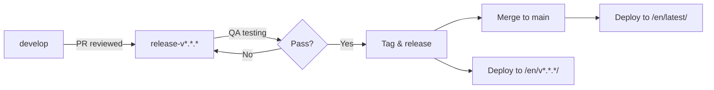
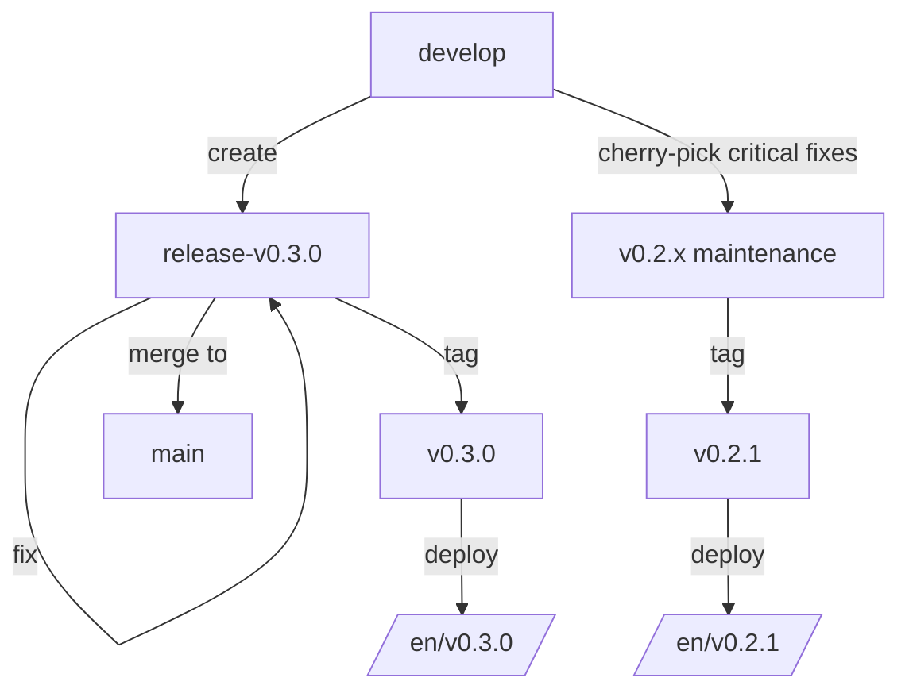

# Contribution Guide

Community developers and contributors are welcome to contribute code, documentation, examples, and issue reports to the UniSDK project.

> **Note on SDK code contributions**: This guide focuses on the **unisdk-doc** documentation repository. For SDK code contributions (unisdk), please refer to the [unisdk repository](https://github.com/telink-semi/unisdk).

---

## Documentation Repository: unisdk-doc

The documentation repository ([unisdk-doc](https://github.com/telink-semi/unisdk-doc)) follows the same branch model as the SDK code repository.

### Branch Model

```
main                                        <- Stable (latest release)
  ^ merge
release-v*.*.*                              <- Release branches
  ^ merge
develop                                     <- Active development
  ^ merge
doc/<topic>  fix/<topic>  feat/<topic>      <- Feature / fix branches
```

| Branch | Purpose | CI/CD Deployment |
|---|---|---|
| `main` | Stable branch. Only updated when a release is finalized. | Pushes deploy to `/en/latest/` |
| `develop` | Active development branch. All documentation changes land here first. | Pushes deploy to `/en/dev/` |
| `release-v*.*.*` | Release preparation branch. Created from `develop` before tagging. | Tag pushes deploy to `/en/v*.*.*/` |
| `doc/*` | Feature branches for documentation changes. | No deployment |
| `fix/*` | Feature branches for documentation fixes. | No deployment |

### Lifecycle

1. **Development**: Create a feature branch from `develop` -> make changes -> open PR -> merge into `develop`
2. **Release**: When ready, create `release-v*.*.*` from `develop` -> finalize -> tag -> CI builds the tag
3. **Stable**: Merge the release branch into `main`, updating the stable documentation

---

## Document Version vs SDK Version

Document versions are **aligned with SDK versions without extra tags** for doc-only fixes:

| Scenario | Doc Tag | Description |
|---|---|---|
| SDK release | `v<SDK version>` (e.g. `v0.2.0`) | One-to-one mapping, doc and SDK released together |
| Doc-only fix | **No tag** | Merge directly to `main`, `latest` auto-updates |
| Dev preview | No tag (develop -> `dev`) | CI deploys to `/en/dev/` |
| Stable placeholder | No tag (main -> `latest`) | CI deploys to `/en/latest/` |

**Core principles**:
1. Doc tags are one-to-one with SDK tags: at most one doc tag per SDK release
2. Doc-only fixes do not create new tags; merge to `main` updates `latest`
3. Published historical versions (e.g. `v0.2.0`) are not retroactively updated

---

## Release Process



1. **Create a release branch** from `develop`:
   ```bash
   git checkout develop
   git checkout -b release-v0.x.x
   ```

2. **Finalize**: Make last-minute fixes on the release branch, run QA.

3. **Tag the release**:
   ```bash
   git tag v0.x.x
   git push origin v0.x.x
   ```
   CI builds and deploys the tag to `/en/v0.x.x/`.

4. **Merge to main**:
   ```bash
   git checkout main
   git merge release-v0.x.x
   git push origin main
   ```
   CI builds and deploys to `/en/latest/`.

---

## Multi-Version Maintenance



- Only the **latest minor version** receives regular maintenance
- The **previous minor version** accepts only security fixes and critical bug fixes (via cherry-pick)
- **Older versions** are not maintained; mark as `DEPRECATED` in docs
- Each minor version gets a `release-v*.*.x` maintenance branch

---

## CI/CD Behavior

| Trigger | Source Checked Out | Deploy Path |
|---|---|---|
| Push to `develop` | `develop` branch | `/en/dev/` |
| Push to `main` | `develop` branch (snapshot) | `/en/latest/` |
| Push tag `v*.*.*` | Tagged commit | `/en/v*.*.*/` |

All versions are built and deployed to the `gh-pages` branch, which serves the documentation via GitHub Pages.

---

## Document Structure Standards

### Directory Naming

| Rule | Description | Example |
|---|---|---|
| Snake case | Lowercase letters + underscores | `getting_started/`, `chips_boards/` |
| Singular form | Directory names use singular | `peripherals/` (already singular) |
| Index entry | Every directory must have `index.md` or `index.rst` | — |
| Images | Place images in `_images/` subdirectory | `peripherals/_images/gpio_1.png` |

Images currently in `pics/` should be migrated to `_images/` over time.

### Frontmatter Metadata

Every documentation page must include a frontmatter block:

```yaml
---
title: Document Title        # Required: display title
status: DRAFT                # Required: STABLE/DRAFT/DEPRECATED/PLANNED
since: v0.1.0                # Optional: version first introduced
updated: v0.2.0              # Optional: version last updated
description: Short summary   # Optional: for search and indexing
tags: [gpio, peripheral]     # Optional: categorization tags
---
```

**Status values**:

| Status | Meaning |
|---|---|
| `STABLE` | Content is complete, reviewed, and ready for production use |
| `DRAFT` | Content is under development, may be incomplete or unreviewed |
| `DEPRECATED` | Content is outdated and should not be used for new designs |
| `PLANNED` | Content is planned but not yet written |

### Version Difference Markers

Use frontmatter fields to track version history:

```yaml
---
title: GPIO Driver Guide
status: STABLE
since: v0.1.0
updated: v0.2.0
---
```

In document body, use Sphinx directives for per-element version tracking:

```rst
.. versionadded:: v0.2.0
   Added DMA transfer mode support

.. deprecated:: v0.1.0
   ``legacy_api()`` is deprecated, use ``new_api()`` instead
```

### File Format Guidelines

| Scenario | Recommended Format | Reason |
|---|---|---|
| TOC files | `.rst` | Needs toctree directive |
| Content pages | `.md` (MyST) | Easier to read and write |
| API reference | `.rst` (auto-generated) | Produced by `gen_api_rst.py` |
| Table-heavy pages | `.rst` | RST table syntax is more powerful |

**Markdown conventions**:
- Heading levels: `#` -> `##` -> `###` -> `####` (max 4 levels)
- Code blocks: annotate language (`` ```c `` , `` ```bash ``)
- Images: use `` with optional `:width:` directive
- Admonitions: use MyST directives like ````{note}`, ````{warning}`, ````{tip}`
- Links: use MyST `{ref}` and `{doc}` for cross-references

**RST conventions**:
- Use `.. code-block:: c` instead of `::` + indentation
- Use `:ref:` and `:doc:` for cross-references
- Use `.. versionadded::` / `.. deprecated::` for version tracking

### Cross-Reference Conventions

| Reference Type | Syntax | Example |
|---|---|---|
| Document link | `{doc}` / `:doc:` | `` {doc}`getting_started/index` `` |
| Section link | `{ref}` / `:ref:` | `` {ref}`my-section-label` `` |
| External link | Markdown link | `[text](url)` |
| API function | `{c:func}` / `:c:func:` | `` {c:func}`tlk_gpio_init` `` |
| API type | `{c:type}` / `:c:type:` | `` {c:type}`tlk_gpio_config_t` `` |
| Term reference | `{term}` / `:term:` | `` {term}`GPIO` `` |

**Label naming convention**:
```
<module>-<section>    Examples: gpio-introduction, uart-dma-mode
```

---

## Submitting Issues

- Use [GitHub Issues](https://github.com/telink-semi/unisdk-doc/issues) to report documentation bugs or request improvements
- Provide the page URL and describe what is incorrect or missing
- Attach screenshots or error logs if applicable

---

## Code Standards (SDK Contributions)

For contributions to the SDK codebase (unisdk):

- C code should follow the format defined in `.clang-format`
- Run `pre-commit` checks before submitting
- See the [unisdk repository](https://github.com/telink-semi/unisdk) for detailed guidelines
