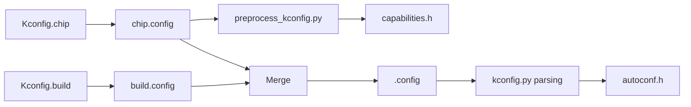

# Kconfig Configuration System

Kconfig is the configuration management core of UniSDK, using a hierarchical structure to manage compile-time configuration options.

## Architecture

### Configuration Entry Points

UniSDK uses a dual-entry Kconfig design:

```
Kconfig.chip     → Chip-related configuration (SoC selection, peripheral enabling)
Kconfig.build    → Build-related configuration (feature options, parameter settings)
```

### Hierarchy

```
Kconfig.chip
├── rsource "core/Kconfig"            # Core configuration
├── rsource "soc/Kconfig"             # Chip series configuration
└── rsource "boards/Kconfig"          # Development board configuration

Kconfig.build
├── rsource "api/Kconfig"             # API configuration
├── rsource "core/configs/Kconfig"    # Core feature configuration
├── rsource "samples/Kconfig"         # Sample configuration
└── rsource "system/Kconfig"          # System configuration
```

### Application-Level Kconfig Integration

Through the `KCONFIG_APPLICATION_DIR` variable, the application layer can define its own Kconfig options, seamlessly integrating with the SDK configuration.

## Configuration Generation Flow



### Key Configuration Files

| File | Source | Description |
|------|--------|-------------|
| `chip.config` | Kconfig.chip | Chip-related configuration (SoC, peripheral enabling) |
| `build.config` | Kconfig.build | Build option configuration |
| `.config` | chip.config + build.config | Final merged configuration |
| `capabilities.h` | chip.config → preprocessing | Chip capability declaration header |
| `autoconf.h` | .config → parsing | C preprocessor macro definitions |

### SOC/BOARD Parameter Handling

```bash
# Specify SOC during build
cmake -B build -DSOC=TLSR9528A -S .
# Specify BOARD during build
cmake -B build -DBOARD=TLSR9528A_EVK -S .

# West command (specify SOC)
west tl-build --soc TLSR9528A

# West command (specify BOARD)
west tl-build --board TLSR9528A_EVK
```

The Kconfig system automatically validates the SOC/BOARD combination compatibility (via `kconfig_parser.py`).

## Key Scripts

| Script | Purpose |
|--------|---------|
| `kconfig.py` | Non-interactive Kconfig processing, configuration merging, validity verification |
| `menuconfig.py` | Interactive terminal configuration interface |
| `preprocess_kconfig.py` | Configuration preprocessing, YAML variable expansion |
| `kconfig_parser.py` | Kconfig parsing and SOC/BOARD validation |
| `soc_board_setter.py` | SOC/BOARD configuration and dependency resolution |

## Menuconfig Trigger Methods

1. **Auto-triggered during build** — Automatically opens the interactive interface when config files are missing
2. **Manually triggered** — `python scripts/menuconfig.py Kconfig.chip`
3. **Non-interactive generation** — CMake configuration phase uses `kconfig.py` to auto-generate defaults

## Configuration Option Examples

```kconfig
# core/configs/Kconfig.gpio

config TLK_GPIO_PORT_A_ENABLED
    bool "Enable GPIO Port A"
    default y
    help
        Enable GPIO Port A instance.

config TLK_GPIO_PREVENT_SLEEP
    bool "Prevent sleep when GPIO is active"
    depends on TLK_PM
    default y
```
