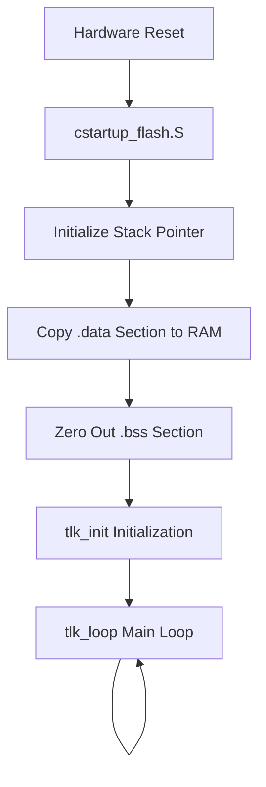

# Core Architecture

This document introduces the core operating mechanisms of UniSDK, including the startup flow, interrupt management, exception handling, and low-power framework.

## System Startup Flow

The startup process of UniSDK begins from hardware reset and goes through the following stages:



### Stage Descriptions

1. **`cstartup_flash.S`** — Assembly startup code, sets up the stack, copies the data segment, zeros BSS, jumps to the C entry point
2. **`tlk_init()`** — SDK initialization function, initializes each subsystem in sequence
3. **`tlk_loop()`** — Main event loop, handles BLE events, timers, etc.

## Initialization System

### init Framework

UniSDK uses a modular initialization framework, implemented through macros defined in `tlk_init.h`:

```c
// Each subsystem registers an initialization callback via TLK_INIT_ENTRY
// Initialization is performed in priority order
```

Initialization Priority Hierarchy:

| Priority | Typical Modules | Description |
|--------|---------|------|
| Earliest | Clock, Memory | System foundational capabilities |
| Early | GPIO, PLIC | Peripheral infrastructure |
| Middle | UART, I2C, SPI | Communication peripherals |
| Late | BLE | Protocol stack |
| Latest | Application Callback | User application initialization |

## Interrupt Management

### PLIC (Platform-Level Interrupt Controller)

RISC-V platforms use PLIC to manage peripheral interrupts:

- **Interrupt Sources** — Each peripheral (GPIO, UART, I2C, etc.) has a dedicated PLIC interrupt number
- **Priority** — PLIC supports multiple interrupt priority levels
- **Interrupt Nesting** — Supports interrupt nesting through preemption

```c
// Enable global interrupts
tlk_core_interrupt_enable();

// Disable global interrupts
tlk_core_interrupt_disable();
```

### GPIO Interrupt Example

```c
// Register GPIO interrupt callback
struct tlk_gpio_irq_callback cb = {
    .handler = my_gpio_handler,
    .pin = GPIO_PIN_0
};
tlk_gpio_irq_add_callback(GPIO_PORT_A, &cb);
tlk_gpio_irq_configure(GPIO_PORT_A, GPIO_PIN_0, TLK_GPIO_INTR_RISING_EDGE);
tlk_core_interrupt_enable();
```

## Low-Power Management

UniSDK supports multiple low-power modes:

| Mode | Power Draw | Wake-Up Speed | Retained Content | Use Case |
|------|------|---------|---------|---------|
| **Suspend** | Medium | Fast (< 1ms) | Most context | Brief idle periods |
| **Deep Retention** | Low | Medium | Partial SRAM retention | Long idle, state must be retained |
| **Deep Sleep** | Very Low | Slow | SRAM not retained | Extended hibernation |

### Typical Usage

```c
#include <tlk_api.h>

void deep_sleep_example(void) {
    // Set GPIO wake-up source
    tlk_pm_set_gpio_wakeup(GPIO_PORT_A, GPIO_PIN_0,
                           TLK_PM_GPIO_WAKEUP_LEVEL_HIGH);

    // Enter Deep Sleep for 10 seconds
    tlk_pm_sleep(TLK_PM_SLEEP_MODE_DEEP_SLEEP, 10000000);

    // Check wake-up reason
    enum tlk_pm_wakeup_source reason = tlk_pm_get_wakeup_reason();
}
```

## Context Switch (tl_context.S)

`tl_context.S` implements light-weight context saving and restoring, used for:

- Register saving on interrupt entry/exit
- State restoration after waking from low-power modes

## Clock System

- **System Timer (STIMER)** — High-precision system timer
- **Machine Timer (MTIMER)** — RISC-V standard timer, used for scheduling and delays
- **Peripheral Clocks** — Independent clock source configuration for each peripheral
