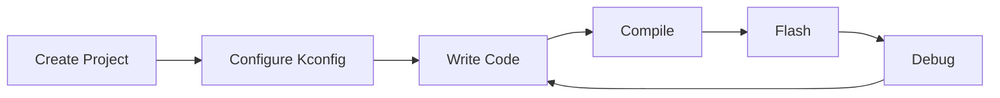

# Development Guide

This chapter is aimed at developers who have started using UniSDK and introduces the complete development workflow and best practices.

## Content Navigation

| Chapter | Description | Status |
|------|------|------|
| [Environment Setup](setup_linux.md) | Platform-specific setup guides (Linux / Windows / macOS) | STABLE |
| [First Example: Blinky](blinky.md) | Detailed step-by-step breakdown of the gpio_demo example | STABLE |
| [SDK Directory Structure](directory_structure.md) | Code organization conventions, responsibilities of each directory | STABLE |
| [Project Creation & Management](project_management.md) | Creating new projects, CMakeLists.txt configuration | STABLE |
| [Core Architecture](core_architecture.md) | Startup flow, exception handling, interrupt management, low-power mechanisms | STABLE |
| [Debugging & Testing](debugging.md) | Hardware debugging, logging system, shell interaction | STABLE |
| [IDE Integration](ide_integration.md) | VS Code clangd configuration, Eclipse, Segger Embedded Studio | STABLE |

## Quick Start for a New Project

```bash
# 1. Create project directory (can be anywhere)
mkdir my_app && cd my_app

# 2. Write CMakeLists.txt (see project_management.md)
cat > CMakeLists.txt << 'EOF'
cmake_minimum_required(VERSION 3.20.0)
find_package(Telink REQUIRED HINTS $ENV{TELINK_BASE})
project(MyApp LANGUAGES C)
file(GLOB C_SOURCES "*.c")
target_sources(Telink PRIVATE ${C_SOURCES})
EOF

# 3. Write main.c
cat > main.c << 'EOF'
#include <tlk_api.h>

int main(void) {
    while (1) {
        tlk_sleep_ms(1000);
    }
    return 0;
}
EOF

# 4. Build
west tl-build . --board TLSR9528A_EVK
```

## Development Workflow Overview



## Next Steps

- [Build & Configuration](../build_config/index.md) — Deep dive into the CMake and Kconfig build system
- [Peripherals & Drivers](../peripherals/index.md) — Use GPIO, UART, I2C and other peripheral drivers
- [Samples & Demos](../samples/index.md) — Reference ready-to-run example code
