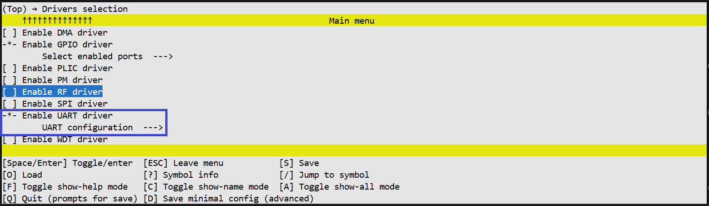
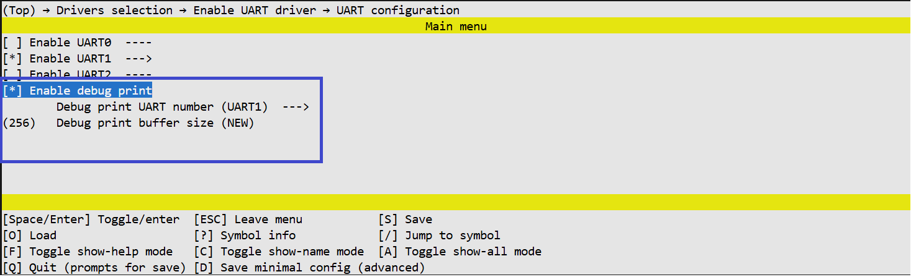

# UART Driver

## Overview

The UART driver provides an interface for configuring and using asynchronous serial ports. It supports communication parameter configuration (baud rate, parity, stop bits), pin multiplexing (Pinmux), data transmission (blocking mode), and data reception (blocking and non-blocking interrupt modes). It also supports hardware flow control (RTS/CTS).

**Key Features:**

- UART parameter configuration (baud rate, parity, stop bits)
- TX/RX and RTS/CTS pin multiplexing
- Data transmission (Blocking / PLIC / DMA modes)
- Data reception (Blocking / PLIC / DMA modes + callback)
- Hardware flow control (RTS/CTS)

## Data Types and Enums

### UART Module Identifiers

`enum tlk_uart_module` — Automatically generated based on `UNISDK_UART_COUNT` and enabled instances. Values include `UART0`, `UART1`, etc.

### Parity

`enum tlk_uart_parity`

| Value | Description |
|---|------|
| `TLK_UART_PARITY_NONE` | No parity |
| `TLK_UART_PARITY_EVEN` | Even parity |
| `TLK_UART_PARITY_ODD` | Odd parity |

### Stop Bits

`enum tlk_uart_stop_bit`

| Value | Description |
|---|------|
| `TLK_UART_STOP_BIT_ONE` | 1 stop bit |
| `TLK_UART_STOP_BIT_ONE_DOT_FIVE` | 1.5 stop bits |
| `TLK_UART_STOP_BIT_TWO` | 2 stop bits |

### Operation Status

`enum tlk_uart_status`

Return codes used by driver functions to indicate the result of an operation.

| Value | Description |
|---|------|
| `TLK_UART_OK` | Operation completed successfully. |
| `TLK_UART_TIMEOUT` | Operation timed out. |
| `TLK_UART_ERROR` | General execution error. |

### Flow Control Modes

!!! info "Requires `CONFIG_TLK_UART_USED_FLOW_CONTROL`"

`enum tlk_uart_flow_control`

| Value | Description |
|---|------|
| `TLK_UART_FLOW_NONE` | Flow control disabled. |
| `TLK_UART_FLOW_RTS` | RTS signal only. |
| `TLK_UART_FLOW_CTS` | CTS signal only. |
| `TLK_UART_FLOW_RTS_CTS` | Full RTS/CTS flow control. |

### Flow Control Polarity

!!! info "Requires `CONFIG_TLK_UART_USED_FLOW_CONTROL`"

`enum tlk_uart_flow_polarity`

Defines the active level logic for RTS and CTS signals.

| Value | Description |
|---|------|
| `TLK_UART_ACTIVE_LOW` | **Active Low.** UART stops sending when CTS is low, and sets RTS low to stop receiving. |
| `TLK_UART_ACTIVE_HIGH` | **Active High.** UART stops sending when CTS is high, and sets RTS high to stop receiving. |

### Transmit Handler Type

`tlk_uart_tx_handler_t`

A function pointer type for the callback invoked when data transmission is complete in interrupt and DMA modes.

```c
typedef void (*tlk_uart_tx_handler_t)(void);
```

### Receive Handler Type

`tlk_uart_rx_handler_t`

A function pointer type for the callback invoked when data reception is complete in interrupt and DMA modes.

```c
typedef void (*tlk_uart_rx_handler_t)(uint32_t rx_count);
```

## Driver API

### `tlk_uart_configure`

Initializes the UART module.

```c
void tlk_uart_configure(enum tlk_uart_module uart_num, uint32_t baudrate,
                        enum tlk_uart_parity parity, enum tlk_uart_stop_bit stop_bit);
```

### `tlk_uart_configure_pinmux`

Configures UART TX/RX pin multiplexing.

```c
void tlk_uart_configure_pinmux(enum tlk_uart_module uart_num,
                               struct tlk_gpio_port_pin tx_port_pin,
                               struct tlk_gpio_port_pin rx_port_pin);
```

### `tlk_uart_send_bytes`

Sends a data buffer.

```c
enum tlk_uart_status tlk_uart_send_bytes(enum tlk_uart_module uart_num,
    const uint8_t *buff, uint32_t buff_size,
    tlk_uart_tx_handler_t tx_handler, uint32_t timeout_us);
```

### `tlk_uart_receive_bytes`

Receives a data buffer.

```c
enum tlk_uart_status tlk_uart_receive_bytes(enum tlk_uart_module uart_num,
    uint8_t *buff, uint32_t buff_size,
    tlk_uart_rx_handler_t rx_handler, uint32_t timeout_us);
```

### `tlk_uart_flow_configure`

!!! info "Requires `CONFIG_TLK_UART_FLOW_CONTROL`"

Configures hardware flow control.

```c
void tlk_uart_flow_configure(enum tlk_uart_module uart_num,
    enum tlk_uart_flow_control flow_control, enum tlk_uart_flow_polarity flow_polarity);
```

### `tlk_uart_configure_flow_control`

!!! info "Requires `CONFIG_TLK_UART_USED_FLOW_CONTROL`"

Configure the flow control for the specified UART module. Disabled by default. Should be called after `tlk_uart_configure`.

```c
void tlk_uart_configure_flow_control(enum tlk_uart_module uart_num,
                         enum tlk_uart_flow_control flow_control,
                         enum tlk_uart_flow_polarity flow_polarity);
```

### `tlk_uart_configure_flow_control_pinmux`

!!! info "Requires `CONFIG_TLK_UART_USED_FLOW_CONTROL`"

Configure UART RTS and CTS pin multiplexing.

```c
void tlk_uart_configure_flow_control_pinmux(enum tlk_uart_module uart_num,
                                struct tlk_gpio_port_pin rts_port_pin,
                                struct tlk_gpio_port_pin cts_port_pin);
```

## Transfer Modes

Each UART instance can independently configure its transfer mode:

| Mode | Kconfig Value | Description |
|------|-----------|------|
| Blocking | `TLK_UART_XFER_BLOCKING` | Synchronous wait, with timeout |
| Interrupt | `TLK_UART_XFER_PLIC` | Interrupt-driven, auto-fill FIFO |
| DMA | `TLK_UART_XFER_DMA` | DMA driven, zero CPU load |

## Kconfig Configuration

### Global options

**`TLK_UART_SELECTED**  
Indicates that at least one UART instance is enabled in the system. This option is automatically selected when any `UART{i}_ENABLED` option is enabled.

**`TLK_UART_USED_AUTO_CONFIG`**  
Indicates that automatic UART configuration is enabled in the system. This option is automatically selected when `UART{i}_AUTO_CONFIG` is enabled for any UART instance.

**`TLK_UART_USED_IRQ`**  
Indicates that at least one UART instance needs a PLIC functionality. This option is automatically selected when `UART{i}_USED_IRQ` or `UART{i}_USED_DMA` are enabled for any UART instance.

**`TLK_UART_USED_DMA`**  
Indicates that at least one UART instance needs a DMA functionality. This option is automatically selected when `UART{i}_USED_DMA` is enabled for any UART instance.

**`TLK_UART_USED_PM_DEVICE`**  
Indicates that UART power management support is enabled in the system. This option is automatically selected when `UART{i}_PM_DEVICE` is enabled for any UART instance.

**`TLK_UART_USED_FLOW_CONTROL`**  
Indicates that hardware flow control (RTS/CTS) is enabled in the system. This option is automatically selected when `UART{i}_FLOW_CONTROL` is enabled for any UART instance.

### Per-instance Configuration

Each UART instance (i = 0, 1, 2...) supports the following hierarchical configuration:

```text
UART{i}_ENABLED
│   Enables the specific UART module.
│
├── UART{i}_AUTO_CONFIG
│   │   Enables automatic driver configuration using the values below.
│   │
│   ├── UART{i}_BAUDRATE
│   │       Sets the communication speed in baud (Default: 115200).
│   │
│   ├── UART{i}_PARITY
│   │   │   Configures the parity check mode for the UART frame.
│   │   ├── TLK_UART_PARITY_NONE      (Default: No parity)
│   │   ├── TLK_UART_PARITY_EVEN      (Even parity)
│   │   └── TLK_UART_PARITY_ODD       (Odd parity)
│   │
│   ├── UART{i}_STOP_BIT
│   │   │   Sets the number of stop bits in a frame.
│   │   ├── TLK_UART_STOP_BIT_ONE           (Default: 1 bit)
│   │   ├── TLK_UART_STOP_BIT_ONE_DOT_FIVE  (1.5 bits)
│   │   └── TLK_UART_STOP_BIT_TWO           (2 bits)
│   │
│   ├── UART{i}_FLOW_CONTROL_TYPE
│   │   │   Selects the hardware flow control mode.
│   │   ├── TLK_UART_FLOW_NONE      (0) - Disabled
│   │   ├── TLK_UART_FLOW_RTS       (1) - RTS only
│   │   ├── TLK_UART_FLOW_CTS       (2) - CTS only
│   │   └── TLK_UART_FLOW_RTS_CTS   (3) - Full RTS/CTS
│   │
│   └── UART{i}_FLOW_POLARITY
│       │   Defines the active logic level for RTS/CTS signals.
│       ├── TLK_UART_ACTIVE_LOW     (0) - Active Low (Default)
│       └── TLK_UART_ACTIVE_HIGH    (1) - Active High
│
├── UART{i}_TX_MODE
│   │   Sets the transmission mode.
│   ├── TLK_UART_XFER_BLOCKING   Blocking mode, which will use the timeout
│   ├── TLK_UART_XFER_IRQ        Interrupt mode, which will automatically replenish the TX FIFO on interrupts
│   └── TLK_UART_XFER_DMA        DMA mode, which will automatically replenish the TX FIFO by DMA channel
│
├── UART{i}_RX_MODE
│   │   Sets the reception mode.
│   ├── TLK_UART_XFER_BLOCKING   Blocking mode, which will use the timeout
│   ├── TLK_UART_XFER_IRQ        Interrupt mode, which will automatically read the RX FIFO on interrupts
│   └── TLK_UART_XFER_DMA        DMA mode, which will automatically read the RX FIFO by DMA channel
│
├── UART{i}_PM_DEVICE
│       Enables Power Management support for the device (saving and restoring data, before/after sleep).
│
└── UART{i}_PREVENT_SLEEP
        Prevents system sleep mode while UART is actively receiving.

TLK_DEBUG_PRINT
│   Enables debug output for UART communication.
│
├── TLK_DEBUG_PRINT_UART
│       Selects which UART instance(s) will output debug messages.
│
└── TLK_DEBUG_PRINT_BUFFER_SIZE
        Sets the buffer size for debug messages (Default: 256 bytes).
```

### View in the menuconfig


*Figure 1. UART driver configurations*


*Figure 2. UART instance configurations*


*Figure 3. UART instance auto-config options*


*Figure 4. UART debug configurations*

## Related Resources

- [UART Samples](../samples/uart.md)
