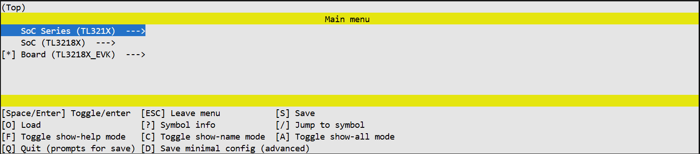
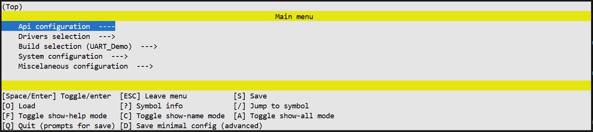

# Menuconfig Configuration Interface

## Overview

Menuconfig is UniSDK's terminal-based interactive system configuration tool, providing visual menu navigation to set all Kconfig configuration options.

**Key Features:**

- Dual-phase configuration: Chip configuration and Build configuration are separated
- Terminal graphical interface with arrow key navigation
- Search function (press `/` key)
- Help system (press `?` key to view option descriptions)
- Automatic dependency management (unavailable options are automatically hidden)
- Merged output: Automatically merges hardware and software configurations into `.config`

## Launch Methods

```bash
# Via Make
make config

# Via West (interactive)
west tl-config

# Via West (CMake only, skip interactive GUI)
west tl-config -c

# Direct invocation
python scripts/menuconfig.py Kconfig.chip     # Chip configuration
python scripts/menuconfig.py Kconfig.build    # Build configuration
```

!!! note "First-time Use"
    `make config` will open the interface twice in sequence: first the chip configuration (Kconfig.chip), then the peripheral build configuration (Kconfig.build).

## Navigation and Operations

| Operation | Key |
|------|------|
| Move up/down | `↑` `↓` or `j` `k` |
| Enter submenu | `Enter` or `→` |
| Return to parent | `ESC` or `←` |
| Toggle option | `Space` |
| Search | `/` |
| View help | `?` |
| Save and exit | Select `< Save >` then `< Exit >` |



*Figure 1. Chip configuration screen — select target SoC and board*



*Figure 2. Build configuration screen — configure software drivers and settings*

## Dual-Phase Configuration

### Phase 1: Chip Configuration (chip.config)

When the tool opens for the first time, you are configuring the hardware.

- **What you see:** Options related to SoC Series, SoC, and Board
- **Action:** Select your target SoC and enable required chip peripherals (GPIO ports, UART instances, etc.)
- **Exit:** Select `< Save >` and `< Exit >` to close the window

### Phase 2: Build Configuration (build.config)

Immediately after the first window closes, the tool opens again for software configuration.

- **What you see:** Options filtered based on chip capabilities (`capabilities.h`), including API configurations, driver selections, and feature switches
- **Action:** Configure feature switches, parameters, examples, and debugging options
- **Exit:** Select `< Save >` and `< Exit >` to finish the process

## Results

After configuration completes, the following files are generated:

```
build/
├── chip.config       # Chip configuration
├── build.config      # Build configuration
├── .config           # Final merged configuration
├── capabilities.h    # Chip capability macros
├── autoconf.h        # Configuration macro definitions
└── pinmux.h          # Pin multiplexing configuration
```

## Internal Execution Flow

### Stage 1: Chip Configuration
1. The system reads `Kconfig.chip` — defines all hardware-related options
2. The user selects settings in the UI
3. Output is saved to a temporary `chip.config` file

### Stage 2: Pre-processing
Between the two windows, `preprocess_kconfig.py` runs automatically to prepare the build configuration stage.

### Stage 3: Build Configuration
1. The system reads `Kconfig.build` — defines software and project settings
2. The user selects settings in the UI
3. Output is saved to a temporary `build.config` file

### Stage 4: Merging
Both stages are combined into the final `.config`:

```bash
cat chip.config build.config > .config
```

This merged file contains the complete system configuration (both hardware and software) and is used by the compiler and the Pinmux tool.

## FAQ

### Arrow Keys Not Working in Windows PowerShell / VS Code

- Use letter keys instead (`j`/`k` for up/down movement)
- Use Windows 11
- Use CMD instead of PowerShell
