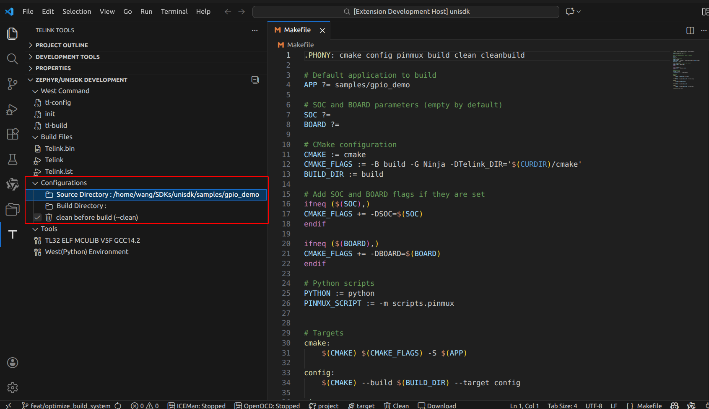
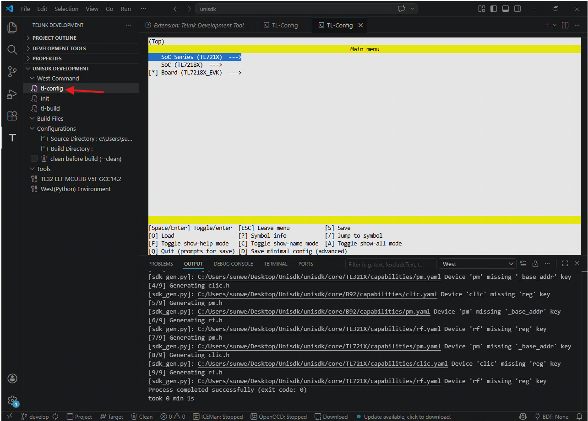
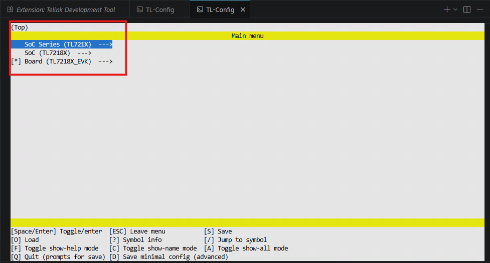
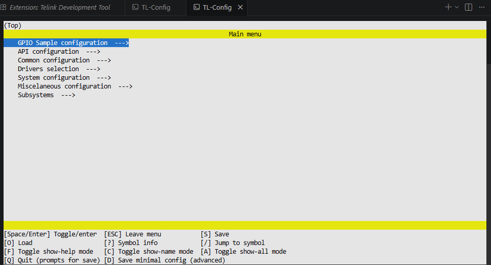
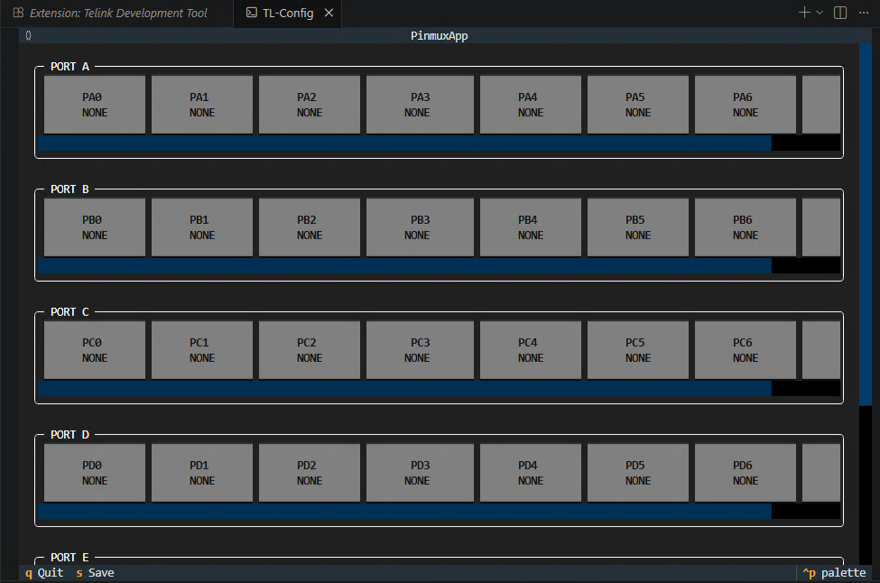

# Compile, Flash and Run Your First Example (VS Code)

This guide walks you through compiling, flashing, and running the first UniSDK example program using the **VS Code Extension GUI**. If you prefer the command-line interface, see the [CLI-based Blinky Guide](../developing/blinky.md).

## Select the First Example

The recommended first example is **gpio_demo** (GPIO LED blinking). It has the simplest logic (only peripheral initialization and a basic loop), the fewest dependencies, and does not involve complex wireless protocol stacks. This provides the shortest path to verify that your toolchain, SDK configuration, and hardware connection (programmer to target board) are all functioning correctly.

Source code location: `samples/gpio_demo/main.c`

## Build the Project

### VS Code Extension (Recommended)

#### Step 1: Select the Source Directory

In the **Telink DEVELOPMENT** view, click the **Source Directory** button (or the folder icon) and choose the `samples/gpio_demo` directory.



#### Step 2: Configure the Chip and Board

1. Click the **tl-config** button to open the configuration interface.

2. Select the target chip and board (for example, TLSR9528A / TLSR9528A_EVK).

3. Configure build options.

4. Configure the pinmux (pin functions). Press **Q** to save and exit at each step.



#### Step 3: Build

Click **tl-build** to start the build. The build output appears in the terminal panel.

After a successful build, the output files are generated in the `build/` directory:

:::{dropdown} Build Output Files
:summary: Click to expand/collapse

```text
build/
├── Telink.bin       # Firmware binary file
├── Telink.elf       # ELF executable (contains debug information)
└── Telink.map       # Memory map file
```
:::

### CLI Approach (Alternative)

For command-line users, refer to the [CLI-based Blinky Guide](../developing/blinky.md) for detailed CLI build and flash instructions.

## Flash the Firmware

### Prerequisite: Connect the Hardware

1. Connect the PC to the Telink programmer using a USB cable.
2. Connect the programmer to the target board using jumper wires:
   - **Power**: VCC ↔ VCC, GND ↔ GND
   - **Data**: SWM (Programmer) ↔ SWS (Target board)

### Flash via BDT (CLI)

```bash
west tl-bdt download --chip TLSR9528A -i build/Telink.bin
```

To specify a flash address:

```bash
west tl-bdt download --chip TLSR9528A -i build/Telink.bin -a 0x00
```

> For GUI-based flashing instructions, refer to the [BDT Tool Guide](../tools/bdt.md).

### Flash via JTAG

JTAG flashing requires the ICEman backend service. For detailed instructions, refer to the [Development Guide](../developing/index.md).

## Verify the Result

After flashing is complete:

1. The development board resets automatically (or press the **Reset** button manually).
2. Observe the on-board LED — it should blink at a fixed interval.
3. (Optional) Connect a serial terminal to view debug log output.

**Expected Result**: The on-board LED blinks periodically, indicating that the application is running successfully on the target chip.

## Next Steps

Congratulations on successfully running your first UniSDK program! Continue exploring:

- [Development Guide](../developing/index.md) — Deep dive into the SDK development workflow
- [Detailed Blinky Guide](../developing/blinky.md) — Step-by-step breakdown of the example
- [Samples & Demos](../samples/index.md) — Explore more example projects
- [Peripherals & Drivers](../peripherals/index.md) — Learn to use GPIO, UART, I2C and more
